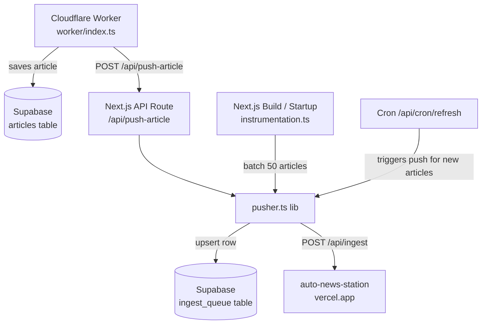
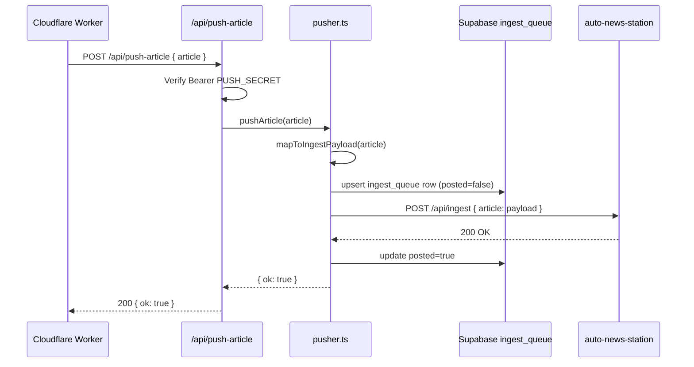
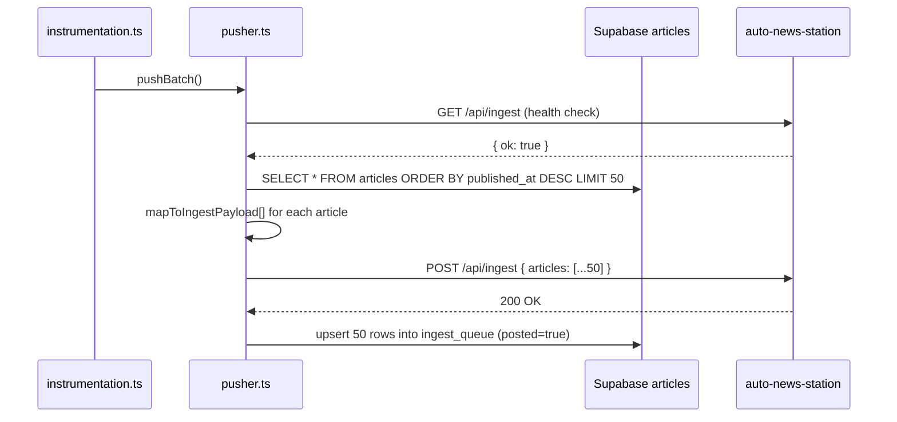

# Design Document: Article Push System

## Overview

The Article Push System automatically forwards every new or updated article published on the PPP TV site to an external social media auto-poster at `https://auto-news-station.vercel.app/api/ingest`. It also performs a bulk backfill of the 50 most recent articles on site startup/build, and persists a local queue in a Supabase `ingest_queue` table for auditability and deduplication.

The system is implemented entirely within the existing Next.js app (`ppp-tv-site-final/`) — no new services or workers are required. It hooks into the existing data flow: the Cloudflare Worker writes articles to Supabase, and a new Next.js API route + a shared pusher library handle forwarding to the auto-poster.

## Architecture



## Sequence Diagrams

### Single Article Push (new/updated article)



### Startup Batch Push (50 most recent articles)



## Components and Interfaces

### Component 1: `src/lib/pusher.ts` (new)

**Purpose**: Core library that maps PPP TV articles to the ingest payload format, writes to `ingest_queue`, and calls the auto-news-station endpoint.

**Interface**:
```typescript
// Maps a PPP TV Article to the auto-news-station ingest format
function mapToIngestPayload(article: Article): IngestArticle

// Push a single article — upserts queue row, calls ingest, marks posted
async function pushArticle(article: Article): Promise<{ ok: boolean; error?: string }>

// Health-check the ingest endpoint
async function checkIngestHealth(): Promise<boolean>

// Fetch 50 most recent articles from Supabase and push as a batch
async function pushBatch(): Promise<{ ok: boolean; pushed: number; error?: string }>
```

**Responsibilities**:
- Category mapping from PPP TV categories to valid ingest categories
- Title uppercasing
- Excerpt extraction (first 2-3 sentences, max 300 chars)
- Image URL deduplication (`imageUrl` = `imageUrlDirect`)
- Supabase `ingest_queue` upsert (idempotent by article `id`)
- HTTP POST to auto-news-station with auth header
- Marking rows `posted=true` on success

### Component 2: `src/app/api/push-article/route.ts` (new)

**Purpose**: Internal Next.js API route that the Cloudflare Worker calls after saving an article, triggering a single-article push.

**Interface**:
```typescript
// POST /api/push-article
// Headers: Authorization: Bearer PUSH_SECRET
// Body: { article: Article }
// Returns: { ok: boolean } | { error: string }
export async function POST(req: NextRequest): Promise<NextResponse>
```

**Responsibilities**:
- Authenticate the request with `PUSH_SECRET`
- Delegate to `pushArticle()` from `pusher.ts`
- Return success/error JSON

### Component 3: `src/instrumentation.ts` (new)

**Purpose**: Next.js instrumentation hook that runs once on server startup/build, triggering the batch push of the 50 most recent articles.

**Interface**:
```typescript
// Called automatically by Next.js on server startup
export async function register(): Promise<void>
```

**Responsibilities**:
- Only run in the `nodejs` runtime (not edge)
- Call `pushBatch()` from `pusher.ts`
- Log result; never throw (startup must not fail)

### Component 4: Cloudflare Worker integration (`worker/index.ts` — modified)

**Purpose**: After saving a new or updated article to Supabase, notify the Next.js push route.

**Responsibilities**:
- After a successful `saveArticleToSupabase()` call, fire a non-blocking POST to `${VERCEL_URL}/api/push-article`
- Use `PUSH_SECRET` env var for auth
- Fire-and-forget (do not block article processing on push success)

## Data Models

### IngestArticle (payload sent to auto-news-station)

```typescript
interface IngestArticle {
  id: string            // article slug
  title: string         // UPPERCASED
  excerpt: string       // first 2-3 sentences, max 300 chars
  content: string       // full body text (HTML stripped)
  category: string      // one of the valid ingest categories
  sourceName: string    // "PPP TV Kenya"
  sourceUrl: string     // https://ppp-tv-site.vercel.app/news/{slug}
  articleUrl: string    // same as sourceUrl
  publishedAt: string   // ISO 8601
  imageUrl: string      // CDN image URL
  imageUrlDirect: string // same as imageUrl
  videoUrl: null | string
  videoEmbedUrl?: null | string
  isBreaking: boolean   // false by default
  tags: string[]
}
```

### ingest_queue Supabase table

```sql
create table if not exists ingest_queue (
  id text primary key,
  title text not null,
  excerpt text default '',
  content text default '',
  category text default 'ENTERTAINMENT',
  source_name text default 'PPP TV Kenya',
  source_url text not null,
  article_url text not null,
  published_at timestamptz default now(),
  image_url text default '',
  image_url_direct text default '',
  video_url text,
  video_embed_url text,
  is_breaking boolean default false,
  tags text[] default '{}',
  ingested_at timestamptz default now(),
  posted boolean default false
);
create index if not exists ingest_queue_posted_idx on ingest_queue(posted, published_at desc);
```

### Category Mapping

PPP TV categories map to valid ingest categories as follows:

```typescript
const CATEGORY_MAP: Record<string, string> = {
  Entertainment: 'ENTERTAINMENT',
  Celebrity:     'CELEBRITY',
  Music:         'MUSIC',
  Sports:        'SPORTS',
  Movies:        'MOVIES',
  Lifestyle:     'LIFESTYLE',
  Technology:    'GENERAL',
  News:          'GENERAL',
  Events:        'EVENTS',
  Fashion:       'FASHION',
  Comedy:        'COMEDY',
}
// Default fallback: 'ENTERTAINMENT'
```

## Algorithmic Pseudocode

### pushArticle Algorithm

```pascal
ALGORITHM pushArticle(article)
INPUT: article of type Article
OUTPUT: { ok: boolean, error?: string }

BEGIN
  payload ← mapToIngestPayload(article)
  
  // Upsert into ingest_queue (idempotent)
  upsertResult ← supabase.upsert('ingest_queue', {
    id:              payload.id,
    title:           payload.title,
    excerpt:         payload.excerpt,
    content:         payload.content,
    category:        payload.category,
    source_name:     payload.sourceName,
    source_url:      payload.sourceUrl,
    article_url:     payload.articleUrl,
    published_at:    payload.publishedAt,
    image_url:       payload.imageUrl,
    image_url_direct: payload.imageUrlDirect,
    is_breaking:     payload.isBreaking,
    tags:            payload.tags,
    posted:          false
  })
  
  // Call auto-news-station
  response ← HTTP POST 'https://auto-news-station.vercel.app/api/ingest'
    headers: { Authorization: 'Bearer ppptvWorker2024', Content-Type: 'application/json' }
    body: { article: payload }
    timeout: 10s
  
  IF response.ok THEN
    supabase.update('ingest_queue', { posted: true }, WHERE id = payload.id)
    RETURN { ok: true }
  ELSE
    RETURN { ok: false, error: response.statusText }
  END IF
END
```

**Preconditions:**
- `article.slug` is non-empty
- `SUPABASE_URL` and `SUPABASE_SERVICE_KEY` are set in environment

**Postconditions:**
- A row exists in `ingest_queue` for this article
- If push succeeded, `posted = true`
- If push failed, `posted = false` (row retained for retry)

**Loop Invariants:** N/A

### pushBatch Algorithm

```pascal
ALGORITHM pushBatch()
INPUT: none
OUTPUT: { ok: boolean, pushed: number, error?: string }

BEGIN
  // Health check first
  health ← HTTP GET 'https://auto-news-station.vercel.app/api/ingest'
    headers: { Authorization: 'Bearer ppptvWorker2024' }
  
  IF NOT health.ok THEN
    RETURN { ok: false, pushed: 0, error: 'Ingest endpoint unavailable' }
  END IF
  
  // Fetch 50 most recent articles from Supabase
  articles ← supabase.select('articles',
    order: 'published_at DESC',
    limit: 50
  )
  
  IF articles.length = 0 THEN
    RETURN { ok: true, pushed: 0 }
  END IF
  
  payloads ← articles.map(mapToIngestPayload)
  
  // Send batch
  response ← HTTP POST 'https://auto-news-station.vercel.app/api/ingest'
    headers: { Authorization: 'Bearer ppptvWorker2024', Content-Type: 'application/json' }
    body: { articles: payloads }
    timeout: 30s
  
  IF response.ok THEN
    // Upsert all as posted=true
    FOR each payload IN payloads DO
      supabase.upsert('ingest_queue', { ...payload, posted: true })
    END FOR
    RETURN { ok: true, pushed: payloads.length }
  ELSE
    RETURN { ok: false, pushed: 0, error: response.statusText }
  END IF
END
```

**Preconditions:**
- `SUPABASE_URL` and `SUPABASE_SERVICE_KEY` are set
- `INGEST_SECRET` is set (or hardcoded fallback used)

**Postconditions:**
- Up to 50 rows upserted into `ingest_queue`
- All successfully pushed rows have `posted = true`

**Loop Invariants:**
- Each upserted row corresponds to a valid article from the `articles` table

### mapToIngestPayload Algorithm

```pascal
ALGORITHM mapToIngestPayload(article)
INPUT: article of type Article
OUTPUT: payload of type IngestArticle

BEGIN
  category ← CATEGORY_MAP[article.category] ?? 'ENTERTAINMENT'
  
  // Strip HTML from content for plain text
  plainContent ← stripHtml(article.content ?? '')
  
  // Extract excerpt: first 2-3 sentences, max 300 chars
  excerpt ← article.excerpt
  IF excerpt = '' THEN
    excerpt ← plainContent.slice(0, 300)
  END IF
  
  articleUrl ← 'https://ppp-tv-site.vercel.app/news/' + article.slug
  
  RETURN {
    id:              article.slug,
    title:           article.title.toUpperCase(),
    excerpt:         excerpt.slice(0, 300),
    content:         plainContent,
    category:        category,
    sourceName:      'PPP TV Kenya',
    sourceUrl:       articleUrl,
    articleUrl:      articleUrl,
    publishedAt:     article.publishedAt,
    imageUrl:        article.imageUrl ?? '',
    imageUrlDirect:  article.imageUrl ?? '',
    videoUrl:        null,
    isBreaking:      false,
    tags:            article.tags ?? []
  }
END
```

## Key Functions with Formal Specifications

### `mapToIngestPayload(article: Article): IngestArticle`

**Preconditions:**
- `article.slug` is a non-empty string
- `article.title` is a non-empty string
- `article.publishedAt` is a valid ISO 8601 date string

**Postconditions:**
- `result.id === article.slug`
- `result.title === article.title.toUpperCase()`
- `result.category` is one of the 13 valid ingest category values
- `result.sourceUrl` and `result.articleUrl` both equal `https://ppp-tv-site.vercel.app/news/{slug}`
- `result.imageUrl === result.imageUrlDirect`
- `result.videoUrl === null`
- `result.isBreaking === false`

### `pushArticle(article: Article): Promise<{ ok: boolean }>`

**Preconditions:**
- `SUPABASE_URL` env var is set
- `SUPABASE_SERVICE_KEY` env var is set

**Postconditions:**
- A row with `id = article.slug` exists in `ingest_queue`
- If `ok === true`, the row has `posted = true`
- If `ok === false`, the row has `posted = false` (retained for future retry)
- No exception is thrown (errors are returned as `{ ok: false, error }`)

### `checkIngestHealth(): Promise<boolean>`

**Preconditions:** None

**Postconditions:**
- Returns `true` if GET `/api/ingest` responds with `{ ok: true }`
- Returns `false` on any network error or non-200 response
- Never throws

## Example Usage

```typescript
// Single article push (called from /api/push-article route)
import { pushArticle } from '@/lib/pusher';

const result = await pushArticle(article);
if (!result.ok) {
  console.error('Push failed:', result.error);
}

// Batch push on startup (instrumentation.ts)
import { pushBatch } from '@/lib/pusher';

const result = await pushBatch();
console.log(`Pushed ${result.pushed} articles on startup`);

// Health check
import { checkIngestHealth } from '@/lib/pusher';

const alive = await checkIngestHealth();
// alive === true means endpoint is reachable
```

## Correctness Properties

*A property is a characteristic or behavior that should hold true across all valid executions of a system — essentially, a formal statement about what the system should do. Properties serve as the bridge between human-readable specifications and machine-verifiable correctness guarantees.*

### Property 1: Category mapping is always valid

*For any* `Article` input, `mapToIngestPayload(article).category` is always one of the 13 valid ingest category strings: `ENTERTAINMENT`, `CELEBRITY`, `MUSIC`, `SPORTS`, `TV & FILM`, `MOVIES`, `FASHION`, `COMEDY`, `AWARDS`, `EVENTS`, `EAST AFRICA`, `LIFESTYLE`, `GENERAL`

**Validates: Requirements 4.1, 4.2, 4.3**

### Property 2: Payload output shape invariants

*For any* `Article` input, `mapToIngestPayload(article)` satisfies all of the following simultaneously:
- `result.title === article.title.toUpperCase()`
- `result.excerpt.length <= 300`
- `result.imageUrl === result.imageUrlDirect`
- `result.videoUrl === null`
- `result.isBreaking === false`
- `result.sourceName === "PPP TV Kenya"`
- `result.id === article.slug`

**Validates: Requirements 8.1, 8.2, 8.3, 8.5, 8.6, 8.7, 8.8**

### Property 3: pushArticle idempotence

*For any* `Article`, calling `pushArticle(article)` twice results in exactly one row in `ingest_queue` for that article's slug — the upsert never creates duplicates

**Validates: Requirements 9.1, 9.2, 9.3**

### Property 4: Batch size bound

*For any* state of the Supabase `articles` table, `pushBatch()` fetches and pushes at most 50 articles in a single call

**Validates: Requirements 3.4**

### Property 5: No-throw guarantee

*For any* input (including malformed articles, network failures, and missing environment variables), neither `pushArticle` nor `pushBatch` nor `checkIngestHealth` ever throws an exception — all errors are returned as `{ ok: false, error }` or `false`

**Validates: Requirements 5.1, 5.2, 5.3**

### Property 6: posted flag reflects push outcome

*For any* article push attempt, the `ingest_queue` row's `posted` field is `true` if and only if the Ingest_Endpoint returned a 2xx response for that article

**Validates: Requirements 1.3, 1.4**

### Property 7: Fire-and-forget does not block ingestion

*For any* article saved by the Cloudflare Worker, the article is persisted to Supabase regardless of whether the push notification to `/api/push-article` succeeds or fails

**Validates: Requirements 2.2, 2.3, 5.4**

### Property 8: INGEST_SECRET is used for all outbound auth

*For any* call to the Ingest_Endpoint, the `Authorization` header value equals `Bearer <INGEST_SECRET>` where `INGEST_SECRET` is read from the environment variable

**Validates: Requirements 7.1, 7.3**

## Error Handling

### Scenario 1: auto-news-station endpoint is down

**Condition**: POST to `/api/ingest` returns non-2xx or times out  
**Response**: `pushArticle` returns `{ ok: false, error: '...' }`. The `ingest_queue` row remains with `posted = false`.  
**Recovery**: The row can be retried manually or via a future retry cron. The article is still saved to Supabase normally.

### Scenario 2: Supabase unavailable during upsert

**Condition**: `SUPABASE_URL` / `SUPABASE_SERVICE_KEY` not set, or Supabase returns an error  
**Response**: The upsert is skipped (best-effort). The push to auto-news-station still proceeds.  
**Recovery**: No queue record is created; the push may still succeed.

### Scenario 3: Worker cannot reach `/api/push-article`

**Condition**: `VERCEL_URL` not set in Worker env, or the Next.js route returns an error  
**Response**: Worker logs the failure and continues. Article is saved to Supabase regardless.  
**Recovery**: The batch push on next startup will cover any missed articles.

### Scenario 4: Startup batch push fails health check

**Condition**: `checkIngestHealth()` returns `false` during `instrumentation.ts` startup  
**Response**: `pushBatch()` returns early with `{ ok: false, pushed: 0 }`. Startup continues normally.  
**Recovery**: Next deployment/restart will retry.

## Testing Strategy

### Unit Testing Approach

- Test `mapToIngestPayload` with articles from each PPP TV category to verify correct category mapping
- Test title uppercasing, excerpt truncation at 300 chars, and `imageUrl === imageUrlDirect`
- Test that `videoUrl` is always `null` and `isBreaking` is always `false`

### Property-Based Testing Approach

**Property Test Library**: fast-check

- For any `Article` input, `mapToIngestPayload(article).category` is always in the set of 13 valid categories
- For any `Article` input, `mapToIngestPayload(article).title` equals `article.title.toUpperCase()`
- For any `Article` input, `mapToIngestPayload(article).excerpt.length <= 300`

### Integration Testing Approach

- Mock the auto-news-station endpoint and verify the correct Authorization header is sent
- Verify that a failed push leaves `posted = false` in `ingest_queue`
- Verify that a successful push sets `posted = true`

## Performance Considerations

- Single-article pushes are fire-and-forget from the Worker — no latency added to article ingestion
- The startup batch is capped at 50 articles to stay within Vercel's function timeout limits
- Supabase upserts use `resolution=merge-duplicates` to handle concurrent pushes safely

## Security Considerations

- The `/api/push-article` route is protected by `PUSH_SECRET` (Bearer token) — only the Cloudflare Worker can call it
- The auto-news-station token (`ppptvWorker2024`) is stored as `INGEST_SECRET` env var, never hardcoded in committed code
- Supabase calls use the service key, which is server-side only and never exposed to the client

## Dependencies

- Supabase REST API (existing — `SUPABASE_URL`, `SUPABASE_SERVICE_KEY`)
- `https://auto-news-station.vercel.app/api/ingest` (external)
- Next.js Instrumentation API (`src/instrumentation.ts`) — requires `experimental.instrumentationHook: true` in `next.config.js`
- No new npm packages required
