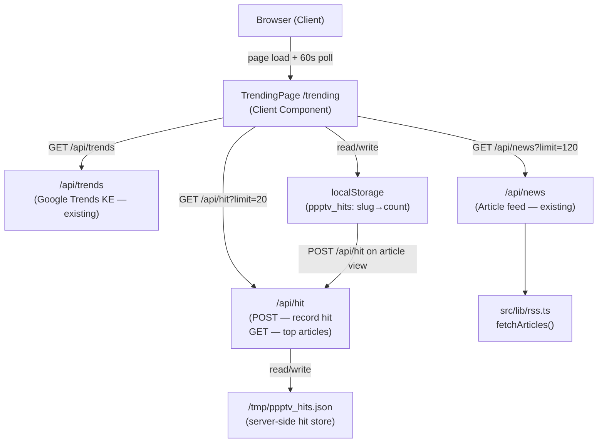
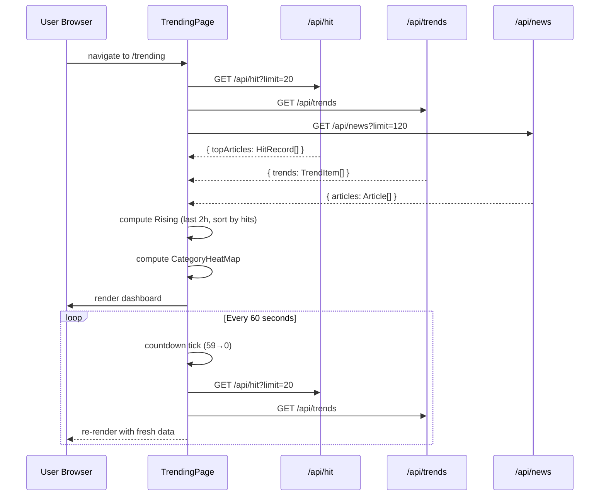
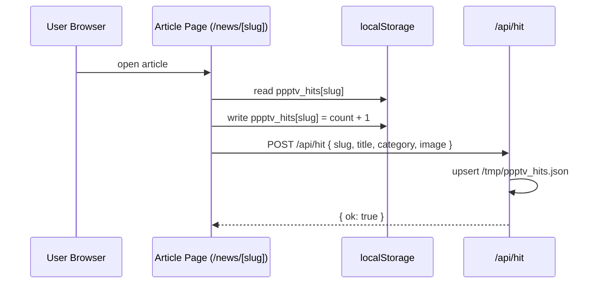

# Design Document: Live Trending Dashboard

## Overview

A "What's Hot" live trending dashboard at `/trending` for PPP TV Kenya that surfaces the most-viewed articles (tracked via localStorage hit counts aggregated through a lightweight API route), Google Trends Kenya data, a "Rising" section for recently published high-engagement articles, a category heat map, auto-refresh every 60 seconds with a live countdown, and a shareable snapshot link — all styled in the existing black/hot-pink brand.

The dashboard is fully self-contained: no external analytics, no third-party tracking. Engagement data lives in the browser's localStorage and is aggregated server-side via a new `/api/hit` route. The page is a Next.js 14 App Router client component that polls on a 60-second interval.

---

## Architecture



---

## Sequence Diagrams

### Page Load & Auto-Refresh Flow



### Article Hit Recording Flow



---

## Components and Interfaces

### TrendingPage (`src/app/trending/page.tsx`)

**Purpose**: Root page component. Fetches all data in parallel, manages 60s auto-refresh countdown, renders all dashboard sections.

**Interface**:
```typescript
// No props — page component
export default function TrendingPage(): JSX.Element
```

**Responsibilities**:
- Parallel fetch of `/api/hit`, `/api/trends`, `/api/news` on mount and every 60s
- Maintain countdown state (60→0, reset on refresh)
- Derive `risingArticles` and `categoryHeatMap` from fetched data
- Render: `<HotHeader>`, `<TopArticlesRail>`, `<GoogleTrendsPanel>`, `<RisingSection>`, `<CategoryHeatMap>`, `<RefreshCountdown>`
- Handle shareable snapshot URL via `CopyLinkBtn`

---

### HitTracker (`src/lib/hitTracker.ts`)

**Purpose**: Client-side utility. Records a hit in localStorage and fires a POST to `/api/hit`.

**Interface**:
```typescript
interface HitPayload {
  slug:     string;
  title:    string;
  category: string;
  image:    string | null;
}

function recordHit(payload: HitPayload): void
function getLocalHits(): Record<string, number>  // slug → count
```

**Responsibilities**:
- Read/write `ppptv_hits` key in localStorage (JSON object: `{ [slug]: count }`)
- Fire-and-forget POST to `/api/hit` — never blocks article page render
- Gracefully no-ops if localStorage is unavailable (SSR, private mode)

---

### `/api/hit` Route (`src/app/api/hit/route.ts`)

**Purpose**: Lightweight hit aggregation endpoint. Accepts POSTs from article pages, serves ranked hit data to the trending dashboard.

**Interface**:
```typescript
// POST /api/hit
// Body: HitPayload
// Response: { ok: boolean }

// GET /api/hit?limit=N
// Response: { hits: HitRecord[], updatedAt: number }

interface HitRecord {
  slug:     string;
  title:    string;
  category: string;
  image:    string | null;
  count:    number;
}
```

**Responsibilities**:
- POST: upsert hit record in `/tmp/ppptv_hits.json`, increment count
- GET: read store, sort by count desc, return top N
- No auth required — rate-limit by IP is out of scope for v1
- `export const dynamic = 'force-dynamic'` — never cached

---

### TopArticlesRail (`src/components/trending/TopArticlesRail.tsx`)

**Purpose**: Horizontal scrollable rail of the top 10 most-hit articles with rank badges.

**Interface**:
```typescript
interface Props {
  articles: HitRecord[];
  loading:  boolean;
}
export default function TopArticlesRail(props: Props): JSX.Element
```

---

### GoogleTrendsPanel (`src/components/trending/GoogleTrendsPanel.tsx`)

**Purpose**: Displays top Google Trends Kenya topics with traffic volume badges.

**Interface**:
```typescript
interface Props {
  trends:  TrendItem[];
  loading: boolean;
}
export default function GoogleTrendsPanel(props: Props): JSX.Element
```

---

### RisingSection (`src/components/trending/RisingSection.tsx`)

**Purpose**: Shows articles published in the last 2 hours, sorted by hit count descending.

**Interface**:
```typescript
interface Props {
  articles: Article[];   // pre-filtered to last 2h, sorted by hits
  loading:  boolean;
}
export default function RisingSection(props: Props): JSX.Element
```

---

### CategoryHeatMap (`src/components/trending/CategoryHeatMap.tsx`)

**Purpose**: Visual grid showing each category's relative "heat" (hit share as a percentage of total hits), using CAT_COLORS and a heat intensity overlay.

**Interface**:
```typescript
interface CategoryHeat {
  category: string;
  count:    number;
  share:    number;   // 0–1, fraction of total hits
  color:    string;   // from CAT_COLORS
}

interface Props {
  data:    CategoryHeat[];
  loading: boolean;
}
export default function CategoryHeatMap(props: Props): JSX.Element
```

---

### RefreshCountdown (`src/components/trending/RefreshCountdown.tsx`)

**Purpose**: Live countdown indicator showing seconds until next auto-refresh, with a pink progress arc.

**Interface**:
```typescript
interface Props {
  secondsLeft: number;   // 0–60
  onRefresh:   () => void;
}
export default function RefreshCountdown(props: Props): JSX.Element
```

---

## Data Models

### HitRecord

```typescript
interface HitRecord {
  slug:      string;       // base64url-encoded article URL (matches Article.slug)
  title:     string;
  category:  string;
  image:     string | null;
  count:     number;       // total hits recorded server-side
  updatedAt: string;       // ISO timestamp of last hit
}
```

**Validation Rules**:
- `slug` must be non-empty string
- `count` must be positive integer ≥ 1
- `category` must be one of the 10 known categories or ignored gracefully

---

### HitStore (persisted to `/tmp/ppptv_hits.json`)

```typescript
type HitStore = Record<string, HitRecord>  // keyed by slug
```

**Constraints**:
- Max 500 entries — oldest by `updatedAt` are evicted when limit exceeded
- Entire file is read/written atomically (JSON.parse / JSON.stringify)

---

### TrendingSnapshot (shareable URL state)

```typescript
interface TrendingSnapshot {
  ts:  number;   // Unix timestamp when snapshot was taken
  top: string[]; // top 5 article slugs at snapshot time
}
// Encoded as base64url query param: /trending?snap=<base64url>
```

---

## Algorithmic Pseudocode

### Main Data Aggregation Algorithm

```pascal
ALGORITHM aggregateTrendingData(hits, articles, trends)
INPUT:
  hits:     HitRecord[]     -- from /api/hit
  articles: Article[]       -- from /api/news (last 120)
  trends:   TrendItem[]     -- from /api/trends

OUTPUT:
  topArticles:    HitRecord[]     -- top 10 by count
  risingArticles: Article[]       -- last 2h, sorted by hit count
  categoryHeat:   CategoryHeat[]  -- per-category heat scores
  googleTrends:   TrendItem[]     -- top 10 Google Trends KE

BEGIN
  // 1. Top articles — already sorted by API
  topArticles ← hits.slice(0, 10)

  // 2. Rising — articles published in last 2 hours
  cutoff ← now() - 2 * 60 * 60 * 1000
  recent ← articles.filter(a => new Date(a.publishedAt) >= cutoff)

  // Enrich recent articles with hit counts
  hitMap ← Map(hits.map(h => [h.slug, h.count]))
  risingArticles ← recent
    .map(a => ({ ...a, hitCount: hitMap.get(a.slug) ?? 0 }))
    .sort((a, b) => b.hitCount - a.hitCount)
    .slice(0, 8)

  // 3. Category heat map
  totalHits ← hits.reduce((sum, h) => sum + h.count, 0)
  catCounts ← Map<string, number>()

  FOR each hit IN hits DO
    catCounts.set(hit.category, (catCounts.get(hit.category) ?? 0) + hit.count)
  END FOR

  categoryHeat ← CATEGORIES.map(cat => ({
    category: cat,
    count:    catCounts.get(cat) ?? 0,
    share:    totalHits > 0 ? (catCounts.get(cat) ?? 0) / totalHits : 0,
    color:    CAT_COLORS[cat]
  }))
  categoryHeat.sort((a, b) => b.count - a.count)

  // 4. Google Trends — pass through, top 10
  googleTrends ← trends.slice(0, 10)

  RETURN { topArticles, risingArticles, categoryHeat, googleTrends }
END
```

**Preconditions**:
- `hits` is a valid (possibly empty) array of HitRecord
- `articles` is a valid (possibly empty) array of Article with `publishedAt` ISO strings
- `trends` is a valid (possibly empty) array of TrendItem

**Postconditions**:
- `topArticles.length` ≤ 10
- `risingArticles` contains only articles where `publishedAt` ≥ now - 2h
- `categoryHeat` contains exactly one entry per known category
- All `share` values sum to ≤ 1.0 (may be < 1 if some hits have unknown categories)

---

### Auto-Refresh Countdown Algorithm

```pascal
ALGORITHM autoRefreshCountdown(refreshFn)
INPUT:  refreshFn — async function to re-fetch all data
OUTPUT: side effects only (state updates)

BEGIN
  secondsLeft ← 60

  EVERY 1 second DO
    secondsLeft ← secondsLeft - 1

    IF secondsLeft <= 0 THEN
      secondsLeft ← 60
      AWAIT refreshFn()
    END IF

    UPDATE countdown display
  END EVERY

  ON component unmount DO
    CLEAR interval
  END ON
END
```

**Loop Invariant**: `secondsLeft` is always in range [0, 60]

---

### Hit Recording Algorithm (client-side)

```pascal
ALGORITHM recordHit(slug, title, category, image)
INPUT: slug, title, category, image

BEGIN
  // 1. Update localStorage (best-effort)
  TRY
    raw   ← localStorage.getItem('ppptv_hits') ?? '{}'
    store ← JSON.parse(raw)
    store[slug] ← (store[slug] ?? 0) + 1
    localStorage.setItem('ppptv_hits', JSON.stringify(store))
  CATCH
    // localStorage unavailable — continue
  END TRY

  // 2. Fire-and-forget POST to server
  fetch('/api/hit', {
    method: 'POST',
    body:   JSON.stringify({ slug, title, category, image }),
    headers: { 'Content-Type': 'application/json' }
  }).catch(() => {})  // never throws
END
```

**Postconditions**:
- localStorage `ppptv_hits[slug]` is incremented by 1 (if available)
- A POST request is dispatched to `/api/hit` (fire-and-forget)
- Function never throws or blocks

---

### Server-Side Hit Upsert Algorithm

```pascal
ALGORITHM upsertHit(slug, title, category, image)
INPUT: slug, title, category, image

BEGIN
  store ← readHitStore()   // parse /tmp/ppptv_hits.json or {}

  IF store[slug] EXISTS THEN
    store[slug].count     ← store[slug].count + 1
    store[slug].updatedAt ← now().toISOString()
  ELSE
    store[slug] ← { slug, title, category, image, count: 1, updatedAt: now().toISOString() }
  END IF

  // Evict oldest entries if over limit
  IF Object.keys(store).length > 500 THEN
    entries ← Object.values(store).sort((a, b) => a.updatedAt < b.updatedAt ? -1 : 1)
    toEvict ← entries.slice(0, entries.length - 500)
    FOR each entry IN toEvict DO
      DELETE store[entry.slug]
    END FOR
  END IF

  writeHitStore(store)   // JSON.stringify to /tmp/ppptv_hits.json
END
```

**Preconditions**: `slug` is non-empty, `count` will be ≥ 1 after upsert

**Postconditions**:
- `store[slug].count` is incremented
- Store size ≤ 500 entries
- `/tmp/ppptv_hits.json` reflects the updated state

---

### Shareable Snapshot Algorithm

```pascal
ALGORITHM generateSnapshot(topArticles)
INPUT: topArticles — HitRecord[] (top 5)
OUTPUT: snapshotUrl — string

BEGIN
  snapshot ← {
    ts:  Date.now(),
    top: topArticles.slice(0, 5).map(a => a.slug)
  }
  encoded ← Buffer.from(JSON.stringify(snapshot)).toString('base64url')
  snapshotUrl ← `${window.location.origin}/trending?snap=${encoded}`
  RETURN snapshotUrl
END
```

---

## Key Functions with Formal Specifications

### `recordHit(payload: HitPayload): void`

**Preconditions**:
- `payload.slug` is a non-empty string
- Called only in browser context (not SSR)

**Postconditions**:
- `localStorage['ppptv_hits'][payload.slug]` incremented by 1 (if localStorage available)
- POST to `/api/hit` dispatched asynchronously
- No exceptions propagated to caller

**Loop Invariants**: N/A

---

### `aggregateTrendingData(hits, articles, trends)`

**Preconditions**:
- All three arrays are defined (may be empty)
- `articles[i].publishedAt` is a valid ISO 8601 string for all i

**Postconditions**:
- Returns object with `topArticles`, `risingArticles`, `categoryHeat`, `googleTrends`
- `risingArticles` ⊆ articles where `publishedAt ≥ now - 2h`
- `categoryHeat.length === CATEGORIES.length` (10 entries)
- `∀ h ∈ categoryHeat: 0 ≤ h.share ≤ 1`

**Loop Invariants**:
- During category count loop: `sum(catCounts.values()) === hits processed so far`

---

### `GET /api/hit?limit=N`

**Preconditions**: `limit` is a positive integer (default 20)

**Postconditions**:
- Returns `{ hits: HitRecord[], updatedAt: number }`
- `hits.length ≤ limit`
- `hits` sorted by `count` descending
- Response is never cached (`force-dynamic`)

---

## Example Usage

```typescript
// 1. Record a hit when user opens an article (src/app/news/[slug]/page.tsx)
import { recordHit } from '@/lib/hitTracker';

useEffect(() => {
  recordHit({ slug: article.slug, title: article.title, category: article.category, image: article.image });
}, []);

// 2. Fetch trending data in TrendingPage
const [hits, trends, news] = await Promise.all([
  fetch('/api/hit?limit=20').then(r => r.json()),
  fetch('/api/trends').then(r => r.json()),
  fetch('/api/news?limit=120').then(r => r.json()),
]);

// 3. Generate shareable snapshot URL
const snap = Buffer.from(JSON.stringify({ ts: Date.now(), top: hits.hits.slice(0,5).map(h => h.slug) })).toString('base64url');
const shareUrl = `${window.location.origin}/trending?snap=${snap}`;

// 4. CategoryHeatMap usage
<CategoryHeatMap
  data={categoryHeat}   // CategoryHeat[] derived from aggregateTrendingData()
  loading={isLoading}
/>
```

---

## Error Handling

### Scenario 1: `/api/hit` POST fails (network error)

**Condition**: Article page fires `recordHit()` but fetch rejects  
**Response**: Silently swallowed — `catch(() => {})` in `recordHit`  
**Recovery**: Hit is still recorded in localStorage; server count may be slightly lower than local count

### Scenario 2: `/tmp/ppptv_hits.json` unreadable (cold start, permissions)

**Condition**: `readHitStore()` throws on file read  
**Response**: Return empty object `{}` — treat as fresh store  
**Recovery**: Hits accumulate from zero; no data loss risk since store is ephemeral

### Scenario 3: All three dashboard APIs fail simultaneously

**Condition**: Network error or server error on all three parallel fetches  
**Response**: Show skeleton loaders; display "Unable to load trending data" message with manual refresh button  
**Recovery**: Auto-retry on next 60s tick

### Scenario 4: No articles published in last 2 hours

**Condition**: `risingArticles` array is empty after filtering  
**Response**: Rising section shows "Nothing new in the last 2 hours — check back soon" with the 3 most recent articles as fallback  
**Recovery**: Automatic — next refresh will re-evaluate

### Scenario 5: Zero hits recorded (fresh deployment)

**Condition**: Hit store is empty, `topArticles` is `[]`  
**Response**: Top Articles rail shows most-recent articles from `/api/news` as a fallback (same as "Editor's Pick" logic in NewsIndex)  
**Recovery**: Organic — as users browse articles, hits accumulate

---

## Testing Strategy

### Unit Testing Approach

Key pure functions to unit test:
- `aggregateTrendingData()` — test with mock hits/articles/trends arrays
- `upsertHit()` — test count increment, eviction at 500 entries
- `generateSnapshot()` — test base64url encoding/decoding round-trip
- `recordHit()` — mock localStorage and fetch, verify both are called

### Property-Based Testing Approach

**Property Test Library**: fast-check

```typescript
// Property 1: categoryHeat shares always sum to ≤ 1
fc.assert(fc.property(
  fc.array(fc.record({ slug: fc.string(), category: fc.constantFrom(...CATEGORIES), count: fc.nat() })),
  (hits) => {
    const { categoryHeat } = aggregateTrendingData(hits, [], []);
    const total = categoryHeat.reduce((s, c) => s + c.share, 0);
    return total <= 1.0 + Number.EPSILON;
  }
));

// Property 2: risingArticles are always within the 2h window
fc.assert(fc.property(
  fc.array(fc.record({ slug: fc.string(), publishedAt: fc.date(), category: fc.string() })),
  (articles) => {
    const { risingArticles } = aggregateTrendingData([], articles, []);
    const cutoff = Date.now() - 2 * 60 * 60 * 1000;
    return risingArticles.every(a => new Date(a.publishedAt).getTime() >= cutoff);
  }
));

// Property 3: upsertHit never exceeds 500 entries
fc.assert(fc.property(
  fc.array(fc.record({ slug: fc.string(), title: fc.string(), category: fc.string() }), { maxLength: 600 }),
  (payloads) => {
    const store = {};
    for (const p of payloads) upsertHitInStore(store, p);
    return Object.keys(store).length <= 500;
  }
));
```

### Integration Testing Approach

- `GET /api/hit` returns sorted array after several `POST /api/hit` calls
- TrendingPage renders all 5 sections without crashing when APIs return empty arrays
- Auto-refresh fires at 60s and updates displayed data

---

## Performance Considerations

- All three API calls are made in parallel (`Promise.all`) — total latency = max(individual latencies), not sum
- `/api/hit` GET is `force-dynamic` but lightweight (single file read + sort) — expected < 10ms
- CategoryHeatMap computation is O(n) in number of hits — negligible
- Auto-refresh uses `setInterval` with cleanup on unmount — no memory leaks
- Article images use the existing `image` field from HitRecord — no additional image fetches on the trending page
- The page itself is a client component (`'use client'`) — no ISR needed since data is always live

---

## Security Considerations

- `/api/hit` POST accepts any slug — no authentication. Abuse risk is low (inflated counts only affect display, not business logic). Rate limiting can be added in v2 via Vercel Edge middleware.
- Snapshot URL encodes only slugs and a timestamp — no PII
- localStorage key `ppptv_hits` stores only slug→count pairs — no sensitive data
- Hit store at `/tmp/ppptv_hits.json` is ephemeral and instance-local — no cross-user data exposure

---

## Dependencies

- **Existing**: `fetchArticles()` from `src/lib/rss.ts`, `/api/trends`, `/api/news`
- **Existing**: `CopyLinkBtn` component (adapted for snapshot URL)
- **Existing**: `CAT_COLORS`, brand tokens (`--pink`, `--card`, `--border`) from `globals.css`
- **New**: `src/lib/hitTracker.ts` — client-side hit recording utility
- **New**: `src/app/api/hit/route.ts` — hit aggregation API route
- **New**: `src/app/trending/page.tsx` — dashboard page
- **New**: `src/components/trending/` — 5 sub-components
- **No new npm packages required**

---

## Correctness Properties

*A property is a characteristic or behavior that should hold true across all valid executions of a system — essentially, a formal statement about what the system should do. Properties serve as the bridge between human-readable specifications and machine-verifiable correctness guarantees.*

### Property 1: Hit count increment

*For any* article slug and any initial localStorage state, calling `recordHit` with that slug should result in `ppptv_hits[slug]` being exactly 1 greater than its previous value (or equal to 1 if it was absent).

**Validates: Requirements 1.1**

---

### Property 2: Server-side upsert correctness

*For any* sequence of POST `/api/hit` calls with the same slug, the resulting `HitRecord.count` should equal the number of times that slug was posted.

**Validates: Requirements 2.1, 2.2**

---

### Property 3: HitStore size invariant

*For any* sequence of upsert operations, the number of entries in the HitStore should never exceed 500.

**Validates: Requirements 2.3**

---

### Property 4: GET /api/hit sort and limit

*For any* HitStore state and any limit N, the response from GET `/api/hit?limit=N` should contain at most N records and those records should be sorted by `count` in descending order.

**Validates: Requirements 2.4**

---

### Property 5: Rising articles time window

*For any* articles array, the `risingArticles` returned by `aggregateTrendingData` should contain only articles whose `publishedAt` is greater than or equal to `now - 2 hours`.

**Validates: Requirements 3.2**

---

### Property 6: Category heat map completeness

*For any* hits array, the `categoryHeat` returned by `aggregateTrendingData` should contain exactly one entry for every category in CATEGORIES.

**Validates: Requirements 3.3**

---

### Property 7: Category share sum invariant

*For any* hits array, the sum of all `share` values in `categoryHeat` should be less than or equal to 1.0 (within floating-point epsilon).

**Validates: Requirements 3.4, 3.5**

---

### Property 8: Snapshot round-trip

*For any* list of up to 5 article slugs and any Unix timestamp, encoding a `TrendingSnapshot` to base64url and then decoding it should produce an equivalent object with the same slugs and timestamp.

**Validates: Requirements 5.1, 5.2, 5.3**

---

### Property 9: recordHit never throws

*For any* HitPayload, calling `recordHit` in an environment where localStorage is unavailable should complete without throwing any exception.

**Validates: Requirements 1.3**
