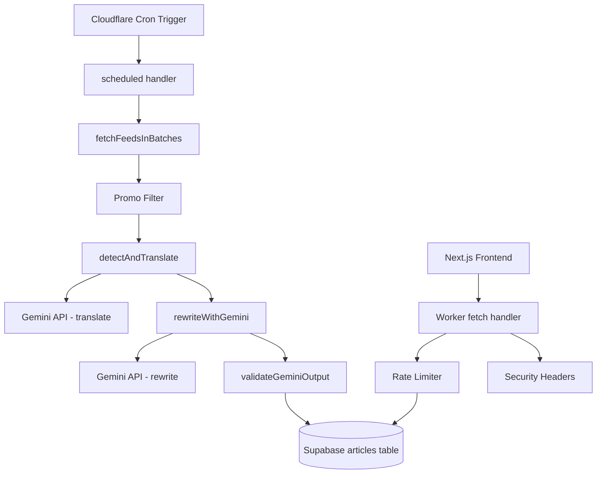
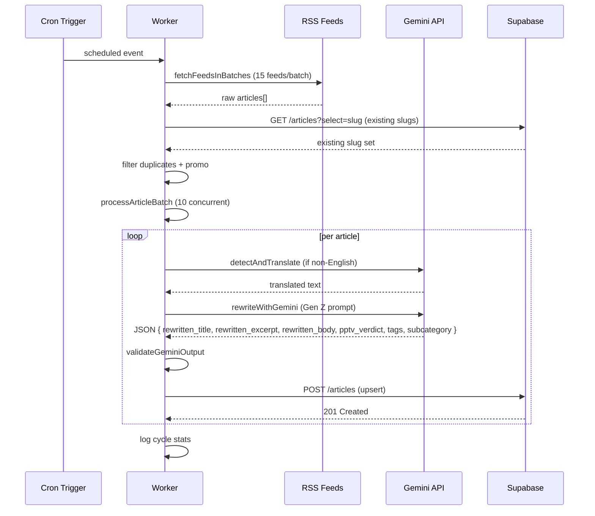
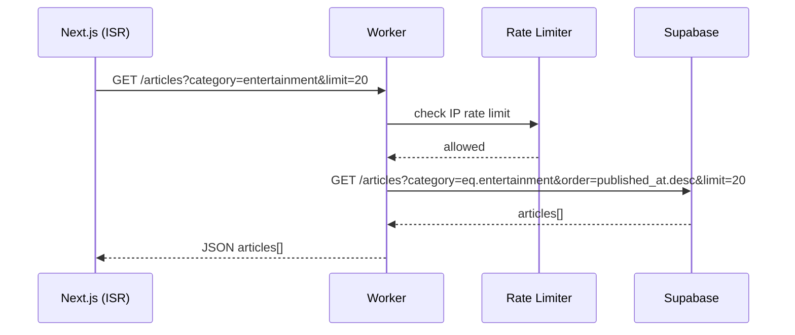

# Design Document: PPP TV AI Rewriter Pivot

## Overview

This pivot transforms the PPP TV Cloudflare Worker from a simple RSS aggregator backed by KV storage into a full AI journalist pipeline. The Worker gains three new capabilities: Gemini-powered article rewriting in a Gen Z voice, automatic language detection and translation, and parallel batch processing. Article storage migrates from Cloudflare KV to Supabase (PostgREST via `fetch`). The Next.js frontend drops the removed categories (Politics, News, Health, Science, Business) and gains subcategory routing for the retained categories. Both the Worker and Next.js are hardened with security headers and rate limiting.

The design follows the existing Worker architecture — a single `index.ts` file with a `scheduled` handler and a `fetch` handler — extending it rather than replacing it. The KV namespace is retained only for subscriber data and rate-limiting keys; all article reads/writes move to Supabase.

## Architecture



## Sequence Diagrams

### Cron Cycle — Article Processing



### Frontend Article Request



## Components and Interfaces

### 1. Gemini Rewriter

**Purpose**: Calls Gemini 1.5 Flash to rewrite a scraped article in the PPP TV Gen Z voice and produce structured JSON output.

**Interface**:
```typescript
interface GeminiRewriteInput {
  title: string;
  excerpt: string;
  content: string;       // plain text, HTML stripped
  sourceName: string;    // used only for context, NOT included in output
  category: string;
  language: string;      // 'en' or detected language code
}

interface GeminiRewriteOutput {
  rewritten_title: string;
  rewritten_excerpt: string;   // max 2 sentences
  rewritten_body: string;      // full HTML body, <p> tags
  pptv_verdict: string;        // 1-2 sentence hot take
  tags: string[];              // exactly 5 tags
  subcategory: string;         // one of the defined subcategory slugs
}

async function rewriteWithGemini(
  article: GeminiRewriteInput,
  env: Env
): Promise<GeminiRewriteOutput | null>
```

**Responsibilities**:
- Build the Gen Z journalist prompt (see Gemini Prompt Design section)
- Call `https://generativelanguage.googleapis.com/v1beta/models/gemini-1.5-flash:generateContent`
- Parse and validate the JSON response
- Return `null` on API error or invalid/incomplete JSON

### 2. Translator

**Purpose**: Detects non-English content and translates it to English via Gemini before rewriting.

**Interface**:
```typescript
async function detectAndTranslate(
  title: string,
  content: string,
  env: Env
): Promise<{ title: string; content: string; detectedLanguage: string }>
```

**Responsibilities**:
- Use a lightweight heuristic first (character set detection for Swahili/French/Arabic common words) to avoid unnecessary API calls
- If non-English detected, call Gemini with a translation prompt
- Return original text unchanged if already English (detectedLanguage = 'en')
- Never throw — return original text on error

### 3. Batch Processor

**Purpose**: Runs article rewriting concurrently, respecting the 10-article limit per cron cycle.

**Interface**:
```typescript
interface ProcessedArticle extends GeminiRewriteOutput {
  slug: string;
  original_title: string;
  image_url: string;
  source_name: string;
  source_url: string;
  published_at: string;
  rewritten_at: string;
  language_detected: string;
  category: string;
  views: number;
  trending_score: number;
}

async function processArticleBatch(
  articles: RawArticle[],
  env: Env
): Promise<{ processed: ProcessedArticle[]; failed: number; skipped: number }>
```

**Responsibilities**:
- Take up to 10 articles, run `Promise.allSettled` for concurrency
- For each article: translate if needed → rewrite → validate → build `ProcessedArticle`
- Count and log failures without throwing
- Return only successfully processed articles

### 4. Supabase Client

**Purpose**: Thin wrapper around `fetch` for Supabase PostgREST operations. No SDK.

**Interface**:
```typescript
function supabaseHeaders(env: Env): HeadersInit {
  return {
    'apikey': env.SUPABASE_SERVICE_KEY,
    'Authorization': `Bearer ${env.SUPABASE_SERVICE_KEY}`,
    'Content-Type': 'application/json',
    'Prefer': 'return=minimal',
  };
}

async function supabaseQuery(
  env: Env,
  path: string,
  options?: RequestInit
): Promise<Response>

// Convenience wrappers:
async function getArticlesFromSupabase(env: Env, filters: ArticleFilters): Promise<SupabaseArticle[]>
async function saveArticleToSupabase(env: Env, article: ProcessedArticle): Promise<boolean>
async function incrementViewsInSupabase(env: Env, slug: string): Promise<void>
async function getExistingSlugs(env: Env): Promise<Set<string>>
```

**Responsibilities**:
- All requests go to `${env.SUPABASE_URL}/rest/v1/articles`
- Use PostgREST query params: `?category=eq.entertainment&order=published_at.desc&limit=20`
- On write failure: log error + retry once, then skip
- Never expose `SUPABASE_SERVICE_KEY` in responses or logs

### 5. Rate Limiter

**Purpose**: In-memory sliding window rate limiter using a `Map<string, number[]>`.

**Interface**:
```typescript
const rateLimitMap = new Map<string, number[]>();

function checkRateLimit(ip: string, limitPerMinute = 60): boolean
// Returns true if request is allowed, false if rate limit exceeded
```

**Responsibilities**:
- Store timestamps of recent requests per IP
- Evict timestamps older than 60 seconds on each check
- Return `false` (→ HTTP 429) when count exceeds `limitPerMinute`
- Note: Map is in-memory per Worker isolate; resets on cold start (acceptable for this use case)

## Data Models

### Supabase `articles` Table Schema

```sql
CREATE TABLE articles (
  id                UUID PRIMARY KEY DEFAULT gen_random_uuid(),
  slug              TEXT UNIQUE NOT NULL,
  original_title    TEXT NOT NULL,
  rewritten_title   TEXT NOT NULL,
  rewritten_excerpt TEXT NOT NULL,
  rewritten_body    TEXT NOT NULL,
  pptv_verdict      TEXT NOT NULL,
  category          TEXT NOT NULL,
  subcategory       TEXT,
  tags              TEXT[] NOT NULL DEFAULT '{}',
  image_url         TEXT,
  source_name       TEXT NOT NULL,
  source_url        TEXT UNIQUE NOT NULL,
  published_at      TIMESTAMPTZ NOT NULL,
  rewritten_at      TIMESTAMPTZ NOT NULL DEFAULT NOW(),
  language_detected TEXT NOT NULL DEFAULT 'en',
  views             INTEGER NOT NULL DEFAULT 0,
  trending_score    NUMERIC(10,4) NOT NULL DEFAULT 0
);

-- Indexes for common query patterns
CREATE INDEX idx_articles_category     ON articles(category, published_at DESC);
CREATE INDEX idx_articles_subcategory  ON articles(subcategory, published_at DESC);
CREATE INDEX idx_articles_trending     ON articles(trending_score DESC);
CREATE INDEX idx_articles_tags         ON articles USING GIN(tags);
CREATE INDEX idx_articles_slug         ON articles(slug);

-- Full-text search
ALTER TABLE articles ADD COLUMN fts tsvector
  GENERATED ALWAYS AS (
    to_tsvector('english', coalesce(rewritten_title,'') || ' ' ||
                           coalesce(rewritten_excerpt,'') || ' ' ||
                           array_to_string(tags, ' '))
  ) STORED;
CREATE INDEX idx_articles_fts ON articles USING GIN(fts);
```

### Updated `Env` Interface

```typescript
export interface Env {
  // Existing
  PPP_TV_KV: KVNamespace;       // retained for subscribers + rate-limit keys
  WORKER_SECRET: string;
  VERCEL_URL?: string;
  // New
  GEMINI_API_KEY: string;
  SUPABASE_URL: string;          // e.g. https://xyzxyz.supabase.co
  SUPABASE_SERVICE_KEY: string;
}
```

### Article Type (Frontend — `src/types/index.ts`)

```typescript
export interface Article {
  id?: string;
  slug: string;
  // Rewritten fields (primary display)
  title: string;              // maps to rewritten_title
  excerpt: string;            // maps to rewritten_excerpt
  content: string;            // maps to rewritten_body
  pptvVerdict?: string;       // maps to pptv_verdict
  // Metadata
  category: string;
  subcategory?: string;
  tags: string[];
  imageUrl: string;
  sourceUrl: string;
  sourceName: string;
  publishedAt: string;
  rewrittenAt?: string;
  languageDetected?: string;
  views?: number;
  trendingScore?: number;
}
```

## Gemini Prompt Design

The prompt is the core of the rewriter. It must produce valid JSON every time and embody the Quillbot philosophy: **preserve all facts, completely transform the writing style**.

### Rewrite Prompt

```
You are a Gen Z entertainment journalist writing for PPP TV Kenya — East Africa's boldest digital media brand.
Your job is to rewrite the article below in PPP TV's signature voice: energetic, opinionated, culturally fluent,
and deeply connected to African and global pop culture. Think: a mix of Buzzfeed Africa, Pulse Kenya, and
a very online Twitter/X personality who actually knows their stuff.

REWRITING RULES (follow all of them):
1. PRESERVE every fact, name, date, number, and quote from the original. Do not invent or omit facts.
2. TRANSFORM the writing style completely — no formal journalism, no passive voice, no boring intros.
3. Start the title with a hook: a reaction, a question, a hot take, or a cultural reference.
4. Start the body with the most interesting/shocking/funny angle — not "According to sources..."
5. Use Gen Z language naturally: "no cap", "lowkey", "slay", "it's giving", "the audacity", "we're not okay",
   "rent free", "understood the assignment", "main character energy" — but don't overdo it.
6. Reference African culture where relevant: Afrobeats, Nairobi, Lagos, Bongo, Gengetone, AFCON, etc.
7. Write the PPP TV Verdict as a spicy, confident 1-2 sentence hot take — PPP TV's editorial opinion.
8. Do NOT mention the original source publication name anywhere in the output.
9. The excerpt must be exactly 1-2 sentences that make someone want to click.
10. Tags must be exactly 5 relevant tags (lowercase, no spaces, use hyphens): e.g. "afrobeats", "kenya-drama".
11. Subcategory must be one of the valid values for the article's category (see list below).
12. Return ONLY valid JSON — no markdown, no explanation, no code fences.

VALID SUBCATEGORIES:
- entertainment: celebrity, music, movies-tv, fashion, relationships, social-media, comedy, reality-tv, awards
- sports: football, basketball, athletics, rugby, cricket, boxing-mma, kenyan-sports
- technology: tech-news, gaming, social-media, ai-innovation, african-tech
- movies: reviews, trailers, nollywood, hollywood, kenyan-film, streaming
- lifestyle: fashion, food, travel, wellness, relationships, home
- trending: (use the most relevant subcategory from any category above)

ORIGINAL ARTICLE:
Category: {{category}}
Title: {{title}}
Content: {{content}}

OUTPUT FORMAT (strict JSON, no other text):
{
  "rewritten_title": "...",
  "rewritten_excerpt": "...",
  "rewritten_body": "<p>...</p><p>...</p>",
  "pptv_verdict": "...",
  "tags": ["tag1", "tag2", "tag3", "tag4", "tag5"],
  "subcategory": "..."
}
```

### Translation Prompt

```
Translate the following article title and body text from {{detectedLanguage}} to English.
Preserve all names, places, numbers, and facts exactly.
Return ONLY valid JSON with no other text:
{
  "title": "...",
  "content": "..."
}

TITLE: {{title}}
CONTENT: {{content}}
```

### Language Detection Heuristic

Before calling Gemini for translation, run a fast heuristic to avoid unnecessary API calls:

```typescript
function detectLanguageHeuristic(text: string): string {
  const sample = text.slice(0, 500).toLowerCase();
  // Swahili markers
  if (/\b(na|wa|ya|za|kwa|ni|pia|lakini|kwamba|kuwa|alikuwa|watu|serikali)\b/.test(sample)) return 'sw';
  // French markers
  if (/\b(le|la|les|de|du|des|est|sont|avec|pour|dans|sur|une|qui)\b/.test(sample)) return 'fr';
  // Arabic script
  if (/[\u0600-\u06FF]/.test(sample)) return 'ar';
  // Portuguese markers
  if (/\b(de|da|do|dos|das|em|para|com|uma|que|não|também)\b/.test(sample)) return 'pt';
  return 'en';
}
```

## Category and Subcategory Routing

### Removed Categories (redirect to `/`)

| Old Route | Action |
|-----------|--------|
| `/politics` | 301 → `/` |
| `/news` | 301 → `/` |
| `/health` | 301 → `/` |
| `/science` | 301 → `/` |
| `/business` | 301 → `/` |

Implemented via `next.config.js` redirects:

```javascript
async redirects() {
  return [
    { source: '/politics', destination: '/', permanent: true },
    { source: '/news',     destination: '/', permanent: true },
    { source: '/health',   destination: '/', permanent: true },
    { source: '/science',  destination: '/', permanent: true },
    { source: '/business', destination: '/', permanent: true },
  ];
}
```

### Retained + New Category Routes

| Route | Category | Subcategory |
|-------|----------|-------------|
| `/entertainment` | entertainment | — |
| `/entertainment/celebrity` | entertainment | celebrity |
| `/entertainment/music` | entertainment | music |
| `/entertainment/movies-tv` | entertainment | movies-tv |
| `/entertainment/fashion` | entertainment | fashion |
| `/sports` | sports | — |
| `/sports/football` | sports | football |
| `/sports/basketball` | sports | basketball |
| `/sports/athletics` | sports | athletics |
| `/technology` | technology | — |
| `/technology/ai-innovation` | technology | ai-innovation |
| `/technology/african-tech` | technology | african-tech |
| `/movies` | movies | — |
| `/lifestyle` | lifestyle | — |
| `/trending` | — | sorted by trending_score |

Subcategory pages use a single dynamic route: `src/app/[category]/[subcategory]/page.tsx`

### Updated Navigation (`Header.tsx`)

```typescript
const NAV = [
  { label: 'Home',          href: '/' },
  { label: 'Shows',         href: '/shows' },
  { label: 'Entertainment', href: '/entertainment' },
  { label: 'Sports',        href: '/sports' },
  { label: 'Movies',        href: '/movies' },
  { label: 'Lifestyle',     href: '/lifestyle' },
  { label: 'Technology',    href: '/technology' },
  { label: '🔥 Trending',   href: '/trending' },
  { label: '🔴 Live',       href: '/live' },
];
```

## Security Headers

### Worker — applied to all responses

```typescript
const SECURITY_HEADERS = {
  'Content-Security-Policy':
    "default-src 'self'; script-src 'self'; style-src 'self' 'unsafe-inline'; img-src * data:; connect-src 'self' https://*.supabase.co https://generativelanguage.googleapis.com; frame-ancestors 'none'",
  'Strict-Transport-Security': 'max-age=31536000; includeSubDomains; preload',
  'X-Frame-Options': 'DENY',
  'X-Content-Type-Options': 'nosniff',
  'Referrer-Policy': 'strict-origin-when-cross-origin',
};
```

Applied by wrapping the existing `json()` helper and adding to the `cors()` function.

### Next.js — `next.config.js` additions

```javascript
const securityHeaders = [
  {
    key: 'Content-Security-Policy',
    value: "default-src 'self'; script-src 'self' 'unsafe-eval' 'unsafe-inline'; style-src 'self' 'unsafe-inline'; img-src * data: blob:; connect-src 'self' https://*.workers.dev https://*.supabase.co; frame-ancestors 'none'",
  },
  { key: 'Strict-Transport-Security', value: 'max-age=31536000; includeSubDomains; preload' },
  { key: 'X-Frame-Options',           value: 'DENY' },
  { key: 'X-Content-Type-Options',    value: 'nosniff' },
  { key: 'Referrer-Policy',           value: 'strict-origin-when-cross-origin' },
];
```

## Trending Score Algorithm

The `trending_score` is recalculated on every view increment:

```typescript
function computeTrendingScore(views: number, publishedAt: string): number {
  const ageHours = (Date.now() - new Date(publishedAt).getTime()) / 3_600_000;
  return views / Math.pow(ageHours + 2, 1.5);
}
```

This is the same formula as the existing KV implementation, now persisted to Supabase on each view update.

## Error Handling

| Scenario | Behavior |
|----------|----------|
| Gemini API error (5xx, timeout) | Log `{ articleUrl, error, status }`, skip article, continue batch |
| Gemini returns incomplete JSON | Discard response, skip article |
| Gemini returns missing required fields | Discard response, skip article |
| Supabase write fails | Log `{ slug, error }`, retry once, then skip |
| RSS feed unreachable | Log failure, continue to next feed |
| Rate limit exceeded | Return HTTP 429 with `Retry-After: 60` header |
| Unauthorized request to protected endpoint | Return HTTP 401 |
| Secret accidentally logged | `SUPABASE_SERVICE_KEY` and `GEMINI_API_KEY` are never interpolated into log strings |

## Testing Strategy

### Unit Testing Approach

Test the pure functions in isolation:
- `validateGeminiOutput(json)` — test with missing fields, wrong types, wrong tag count
- `detectLanguageHeuristic(text)` — test with Swahili, French, Arabic, English samples
- `computeTrendingScore(views, publishedAt)` — verify decay curve
- `checkRateLimit(ip)` — verify sliding window eviction
- `slugify(text)` — verify URL-safe output

### Property-Based Testing Approach

**Property Test Library**: fast-check

Key properties to verify:
- `∀ article: validateGeminiOutput(rewriteWithGemini(article))` — rewriter always produces valid output structure
- `∀ text: detectLanguageHeuristic(text) ∈ {'en','sw','fr','ar','pt'}` — heuristic always returns a known code
- `∀ views ≥ 0, publishedAt: computeTrendingScore(views, publishedAt) ≥ 0` — score is always non-negative
- `∀ ip, n > 60: checkRateLimit(ip) after n requests in 60s === false` — rate limiter never allows over limit

### Integration Testing Approach

- Mock Gemini API responses and verify the full `processArticleBatch` pipeline produces correctly shaped `ProcessedArticle` objects
- Mock Supabase responses and verify `saveArticleToSupabase` retries once on failure then skips
- Verify duplicate slug detection: same `source_url` submitted twice → second is skipped

## Dependencies

| Dependency | Purpose | Notes |
|------------|---------|-------|
| Gemini 1.5 Flash API | Article rewriting + translation | `GEMINI_API_KEY` env var |
| Supabase (PostgREST) | Article storage + querying | `SUPABASE_URL` + `SUPABASE_SERVICE_KEY` env vars |
| Cloudflare KV | Subscriber storage + rate-limit keys only | Existing `PPP_TV_KV` binding retained |
| Cloudflare Workers | Runtime | Existing deployment |
| Next.js 14 (ISR) | Frontend | Existing Vercel deployment |

No new npm packages are required. All Gemini and Supabase calls use the native `fetch` API available in the Cloudflare Workers runtime.
