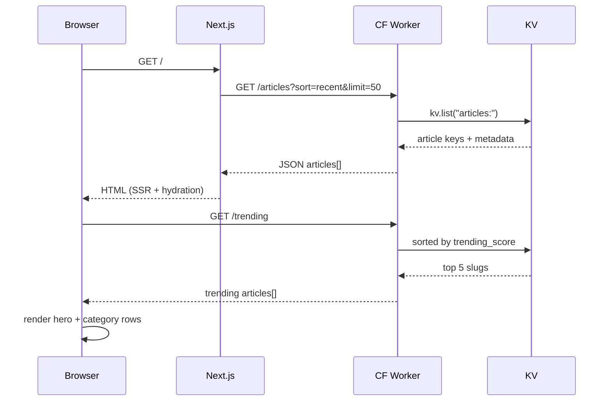
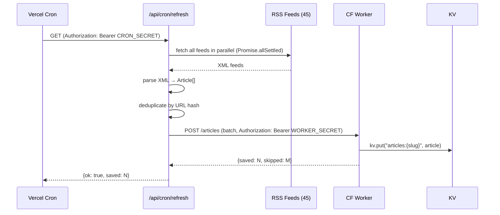
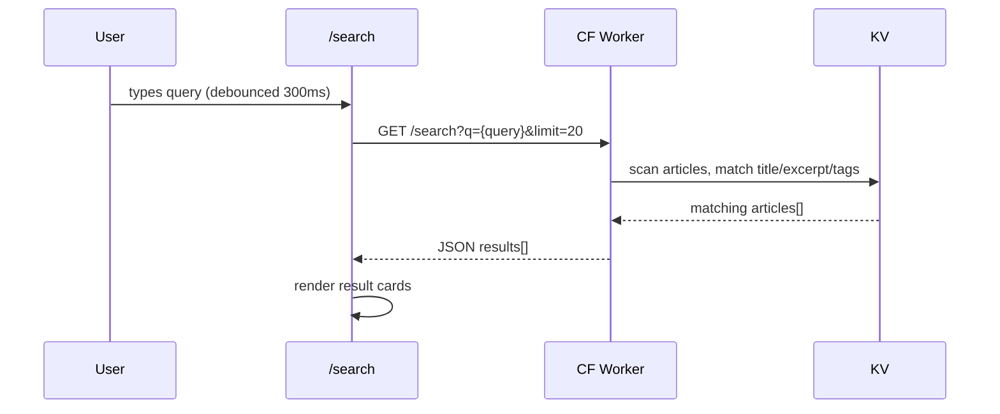

# Design Document: PPP TV Kenya Site (ppp-tv-site-final)

## Overview

PPP TV Kenya is the official website for PPP TV Kenya, a Kenyan entertainment TV channel broadcast on StarTimes Channel 430. The site is a digital companion to the channel — Africa-focused (Kenya primary) covering news, entertainment, sports, music, culture, lifestyle, and events. The homepage is a Netflix-style interactive news feed powered by a Cloudflare Worker backend with KV storage, auto-refreshed via RSS cron jobs. The UI is dark, bold, and fast — built on Next.js 14 App Router with TypeScript and Tailwind CSS.

The site replaces the deleted `eugineous/ppptv-v2` repo with a clean, fully-functional build. Every page is real content — no placeholders. Key fixes from the previous version: working search, working /artists page, working /video page, RecentlyViewed linking to /news/[slug], and a fully interactive Netflix-style homepage.

## Architecture

```mermaid
graph TD
    subgraph "Next.js 14 App (Vercel)"
        A[App Router / Layout] --> B[Homepage - Netflix Feed]
        A --> C[/shows + /shows/slug]
        A --> D[/hosts + /hosts/slug]
        A --> E[/live]
        A --> F[/search]
        A --> G[/saved]
        A --> H[/video]
        A --> I[/artists]
        A --> J[/events]
        A --> K[/about /contact /staff]
        A --> L[/analytics]
        A --> M[/schedule]
        A --> N[/news/slug]
        API[API Routes] --> API1[/api/newsletter]
        API --> API2[/api/analytics]
        API --> API3[/api/cron/refresh]
        API --> API4[/api/revalidate]
    end

    subgraph "Cloudflare Worker + KV"
        W[Worker Router] --> W1[GET /articles]
        W --> W2[POST /articles]
        W --> W3[POST /views]
        W --> W4[GET /views/:slug]
        W --> W5[GET /analytics]
        W --> W6[GET /trending]
        W --> W7[GET /search?q=]
        W --> W8[GET /image?url=]
        W --> W9[POST /subscribe]
        W --> W10[GET /subscribers]
        KV[(KV Store)] --- W1
        KV --- W2
        KV --- W3
        KV --- W6
        KV --- W9
    end

    subgraph "External"
        RSS[45 RSS Feeds] --> API3
        YT[YouTube - PPPTVKENYA] --> E
        YT --> H
    end

    API3 -->|POST /articles| W2
    B -->|GET /articles| W1
    F -->|GET /search| W7
    N -->|POST /views| W3
```

## Sequence Diagrams

### Homepage Load Flow



### Cron Refresh Flow



### Search Flow



## Components and Interfaces

### Component: Header

**Purpose**: Sticky global navigation with logo, desktop nav, mobile menu trigger, search icon.

**Interface**:

```typescript
// No props — reads from static nav config
export default function Header(): JSX.Element;

interface NavItem {
  label: string;
  href?: string;
  dropdown?: DropdownItem[];
}

interface DropdownItem {
  label: string;
  href: string;
}
```

**Responsibilities**:

- Sticky z-50, black bg, 3px pink bottom border, h-16
- Left: PPP TV logo (icon.png 52×52) linking to /
- Center (desktop): Shows dropdown, People dropdown, Events, Video, 🔴 Live, Contact
- Right: search icon (desktop only)
- Mobile: renders MobileMenu trigger only

### Component: MobileMenu

**Purpose**: Full-screen slide-in mobile navigation, loaded client-side only via dynamic().

**Interface**:

```typescript
interface MobileMenuProps {
  isOpen: boolean;
  onClose: () => void;
}
```

**Responsibilities**:

- Loaded with `dynamic(() => import('./MobileMenu'), { ssr: false })`
- Full-screen overlay, black bg, pink accents
- All nav links including dropdowns expanded

### Component: MobileBottomNav

**Purpose**: Fixed bottom navigation bar for mobile (5 items).

**Interface**:

```typescript
// No props — static nav items
export default function MobileBottomNav(): JSX.Element;

const NAV_ITEMS = [
  { label: "Home", href: "/", icon: HomeIcon },
  { label: "Shows", href: "/shows", icon: TvIcon },
  { label: "Video", href: "/video", icon: PlayIcon },
  { label: "Live", href: "/live", icon: RadioIcon },
  { label: "Search", href: "/search", icon: SearchIcon },
];
```

### Component: HeroBanner

**Purpose**: Full-bleed featured article hero on homepage.

**Interface**:

```typescript
interface HeroBannerProps {
  article: Article;
}
```

**Responsibilities**:

- Full-bleed image via next/image with gradient overlay (bottom-up, black)
- Category badge (pink), title (Bebas Neue, large), excerpt (2-line clamp)
- "Read More" CTA (pink button) + "Watch Live" secondary CTA
- Links to /news/[slug] and /live respectively

### Component: CategoryRow

**Purpose**: Horizontally scrollable row of article cards for a single category.

**Interface**:

```typescript
interface CategoryRowProps {
  category: string;
  articles: Article[];
  accentColor?: string; // defaults to #FF007A
}
```

**Responsibilities**:

- Category label (9px, 900 weight, .2em letter-spacing, uppercase, pink) + "See All →" link
- Pink accent bar (4px × 32px, borderRadius 2px) left of label
- Horizontally scrollable container (hide scrollbar, snap scroll)
- Renders ArticleCard for each article

### Component: ArticleCard

**Purpose**: 16:9 thumbnail card with hover preview overlay.

**Interface**:

```typescript
interface ArticleCardProps {
  article: Article;
  priority?: boolean;
}
```

**Responsibilities**:

- 16:9 aspect ratio thumbnail via next/image
- Category badge (top-left), time-ago (bottom-right)
- Title (2-line clamp, DM Sans)
- Hover: scale(1.05) transition-500, excerpt overlay slides up
- Bookmark icon (top-right), toggles localStorage saved state
- Links to /news/[slug]

### Component: NewsletterBar

**Purpose**: Email subscription bar, loaded client-side only.

**Interface**:

```typescript
// No props — self-contained form
export default function NewsletterBar(): JSX.Element;
```

**Responsibilities**:

- POST to /api/newsletter with {email}
- Shows success/error state
- Rate limited server-side (5/min/IP)

### Component: RecentlyViewed

**Purpose**: Horizontal strip of recently viewed articles from localStorage.

**Interface**:

```typescript
// No props — reads from localStorage
export default function RecentlyViewed(): JSX.Element;
```

**Responsibilities**:

- Loaded with `dynamic(() => import('./RecentlyViewed'), { ssr: false })`
- Reads `ppp_recently_viewed` from localStorage (max 10 items)
- Links to /news/[slug] (NOT /articles/[slug])
- Renders compact cards

### Component: BackToTop

**Purpose**: Floating button that appears after scrolling 400px.

**Interface**:

```typescript
// No props
export default function BackToTop(): JSX.Element;
```

### Component: Footer

**Purpose**: Global footer with social links and nav grid.

**Interface**:

```typescript
// No props — static content
export default function Footer(): JSX.Element;
```

**Responsibilities**:

- bg #080808
- Social icons: Instagram, X, YouTube, Facebook, TikTok (with real URLs)
- 2-column links grid
- Copyright line

## Data Models

### Article

```typescript
interface Article {
  slug: string; // URL-safe unique identifier (hash of URL)
  title: string;
  excerpt: string; // 1-2 sentence summary
  content?: string; // full HTML content (optional, for article page)
  category: string; // e.g. "Entertainment", "Sports", "Breaking News"
  tags: string[];
  imageUrl: string; // proxied via CF Worker /image?url=
  sourceUrl: string; // original RSS item link
  sourceName: string; // e.g. "Tuko", "Nation Africa"
  publishedAt: string; // ISO 8601
  createdAt: string; // ISO 8601 (when saved to KV)
  viewCount: number;
  trendingScore: number; // computed: views / age_hours
}
```

**Validation Rules**:

- `slug` must be non-empty, URL-safe string
- `title` must be non-empty, max 200 chars
- `imageUrl` must be a valid URL
- `publishedAt` must be valid ISO 8601 date
- `category` must be one of the defined categories

### Show

```typescript
interface Show {
  slug: string;
  name: string;
  tagline: string;
  description: string;
  schedule: string; // e.g. "Daily 7PM"
  category: string;
  accentColor: string; // hex color
  hosts: string[]; // host slugs
  imageUrl?: string;
}
```

### Host

```typescript
interface Host {
  slug: string;
  name: string;
  title: string;
  bio: string;
  imageUrl?: string;
  instagramUrl?: string;
  shows: string[]; // show slugs
}
```

### Artist

```typescript
interface Artist {
  slug: string;
  name: string;
  genre: string;
  bio: string;
  initials: string;
  featured: boolean;
  imageUrl?: string;
}
```

### NewsletterSubscriber

```typescript
interface NewsletterSubscriber {
  email: string;
  subscribedAt: string; // ISO 8601
  ip?: string; // hashed for privacy
}
```

### AnalyticsHit

```typescript
interface AnalyticsHit {
  slug: string;
  path: string;
  referrer?: string;
  timestamp: string; // ISO 8601
  country?: string; // from CF-IPCountry header
}
```

## Algorithmic Pseudocode

### RSS Cron Refresh Algorithm

```pascal
ALGORITHM refreshRSSFeeds()
INPUT: CRON_SECRET from Authorization header
OUTPUT: {ok: boolean, saved: number, skipped: number, errors: number}

BEGIN
  IF Authorization header != "Bearer " + CRON_SECRET THEN
    RETURN HTTP 401
  END IF

  feeds ← loadRSSFeedList()  // 45 sources
  results ← AWAIT Promise.allSettled(
    feeds.MAP(feed → fetchAndParseFeed(feed))
  )

  allArticles ← []
  errorCount ← 0

  FOR each result IN results DO
    IF result.status = "fulfilled" THEN
      allArticles.APPEND(result.value)
    ELSE
      errorCount ← errorCount + 1
    END IF
  END FOR

  // Deduplicate by URL hash
  seen ← new Set()
  unique ← []
  FOR each article IN allArticles DO
    hash ← md5(article.sourceUrl)
    IF hash NOT IN seen THEN
      seen.ADD(hash)
      unique.APPEND(article)
    END IF
  END FOR

  // Batch POST to Cloudflare Worker
  response ← AWAIT fetch(WORKER_URL + "/articles", {
    method: "POST",
    headers: { Authorization: "Bearer " + WORKER_SECRET },
    body: JSON.stringify(unique)
  })

  result ← AWAIT response.json()
  RETURN { ok: true, saved: result.saved, skipped: result.skipped, errors: errorCount }
END
```

**Preconditions**:

- `CRON_SECRET` env var is set
- `WORKER_URL` and `WORKER_SECRET` env vars are set
- RSS feed list is non-empty

**Postconditions**:

- New articles are persisted in KV store
- Duplicate articles (by URL hash) are skipped
- Returns count of saved, skipped, and errored feeds

**Loop Invariants**:

- `seen` set grows monotonically; no article URL is processed twice
- `errorCount` only increments, never decrements

### Trending Score Algorithm (Cloudflare Worker)

```pascal
ALGORITHM computeTrendingScore(article, currentTime)
INPUT: article: Article, currentTime: timestamp
OUTPUT: score: float

BEGIN
  ageHours ← (currentTime - article.publishedAt) / 3600000

  IF ageHours < 1 THEN
    ageHours ← 1  // prevent division by zero / over-boosting
  END IF

  // Gravity decay: older articles score lower
  score ← article.viewCount / POW(ageHours + 2, 1.8)

  RETURN score
END
```

**Preconditions**:

- `article.viewCount` >= 0
- `article.publishedAt` is a valid timestamp <= `currentTime`

**Postconditions**:

- Returns a non-negative float
- Articles published more recently with more views score higher
- Score approaches 0 as age increases

### Search Algorithm (Cloudflare Worker)

```pascal
ALGORITHM searchArticles(query, limit)
INPUT: query: string, limit: number (default 20)
OUTPUT: Article[]

BEGIN
  IF query.trim() = "" THEN
    RETURN []
  END IF

  terms ← query.toLowerCase().split(" ").filter(t → t.length > 2)
  allKeys ← AWAIT kv.list("articles:")
  results ← []

  FOR each key IN allKeys DO
    article ← AWAIT kv.get(key)
    score ← 0

    FOR each term IN terms DO
      IF article.title.toLowerCase() CONTAINS term THEN
        score ← score + 3
      END IF
      IF article.excerpt.toLowerCase() CONTAINS term THEN
        score ← score + 2
      END IF
      IF article.tags CONTAINS term THEN
        score ← score + 1
      END IF
      IF article.category.toLowerCase() CONTAINS term THEN
        score ← score + 2
      END IF
    END FOR

    IF score > 0 THEN
      results.APPEND({ article, score })
    END IF
  END FOR

  results.SORT(descending by score)
  RETURN results.SLICE(0, limit).MAP(r → r.article)
END
```

**Preconditions**:

- `query` is a non-null string
- `limit` is a positive integer

**Postconditions**:

- Returns at most `limit` articles
- Results are sorted by relevance score (descending)
- Empty query returns empty array

**Loop Invariants**:

- `score` for each article is non-negative
- Only articles with score > 0 are included in results

### View Count + Recently Viewed (Client-Side)

```pascal
ALGORITHM recordView(slug, title, imageUrl)
INPUT: slug: string, title: string, imageUrl: string
OUTPUT: void (side effects: KV update + localStorage update)

BEGIN
  // 1. POST view to Cloudflare Worker (fire-and-forget)
  fetch(WORKER_URL + "/views", {
    method: "POST",
    body: JSON.stringify({ slug })
  })

  // 2. Update localStorage recently viewed
  existing ← JSON.parse(localStorage.getItem("ppp_recently_viewed") ?? "[]")
  filtered ← existing.FILTER(item → item.slug != slug)
  updated ← [{ slug, title, imageUrl, viewedAt: Date.now() }, ...filtered]
  trimmed ← updated.SLICE(0, 10)
  localStorage.setItem("ppp_recently_viewed", JSON.stringify(trimmed))
END
```

## Key Functions with Formal Specifications

### fetchArticles()

```typescript
async function fetchArticles(params: {
  category?: string;
  sort?: "recent" | "trending";
  limit?: number;
  offset?: number;
}): Promise<Article[]>;
```

**Preconditions**:

- `NEXT_PUBLIC_WORKER_URL` is set
- `limit` is between 1 and 100 (defaults to 20)

**Postconditions**:

- Returns array of Article objects (may be empty)
- Articles are sorted by `sort` param (default: recent)
- If `category` is provided, only articles of that category are returned
- On network error, returns empty array (never throws to caller)

### parseRSSFeed()

```typescript
async function parseRSSFeed(feedUrl: string): Promise<Article[]>;
```

**Preconditions**:

- `feedUrl` is a valid URL string
- Feed is reachable (network available)

**Postconditions**:

- Returns array of Article objects parsed from RSS items
- Each article has: title, excerpt, sourceUrl, publishedAt, sourceName, imageUrl
- Returns empty array if feed is unreachable or malformed (never throws)
- `imageUrl` falls back to a placeholder if no image in feed item

### slugify()

```typescript
function slugify(url: string): string;
```

**Preconditions**:

- `url` is a non-empty string

**Postconditions**:

- Returns a URL-safe string (lowercase, hyphens, no special chars)
- Deterministic: same input always produces same output
- Output is max 80 chars

### timeAgo()

```typescript
function timeAgo(dateString: string): string;
```

**Preconditions**:

- `dateString` is a valid ISO 8601 date string

**Postconditions**:

- Returns human-readable relative time (e.g. "2h ago", "3d ago")
- Never returns empty string (falls back to "recently")

## Example Usage

```typescript
// Homepage: fetch articles for hero + category rows
const [featured, ...rest] = await fetchArticles({ sort: "recent", limit: 50 });

const categories = [
  "Breaking News",
  "Entertainment",
  "Sports",
  "Music",
  "Lifestyle",
  "East Africa",
  "Campus Life",
  "Gospel",
];
const rows = categories.map((cat) => ({
  category: cat,
  articles: rest.filter((a) => a.category === cat).slice(0, 10),
}));

// Search page: debounced search
const [query, setQuery] = useState("");
const [results, setResults] = useState<Article[]>([]);

useEffect(() => {
  const timer = setTimeout(async () => {
    if (query.length < 2) return setResults([]);
    const res = await fetch(
      `${WORKER_URL}/search?q=${encodeURIComponent(query)}&limit=20`,
    );
    setResults(await res.json());
  }, 300);
  return () => clearTimeout(timer);
}, [query]);

// Article page: record view on mount
useEffect(() => {
  recordView(slug, article.title, article.imageUrl);
}, [slug]);

// Saved page: read bookmarks from localStorage
const saved = JSON.parse(
  localStorage.getItem("ppp_bookmarks") ?? "[]",
) as Article[];
```

## Correctness Properties

```typescript
// P1: Every article card links to /news/[slug], never /articles/[slug]
assert(articleCardHref.startsWith("/news/"));

// P2: RecentlyViewed items link to /news/[slug]
assert(recentlyViewedHref.startsWith("/news/"));

// P3: Search returns empty array for empty query
assert(searchArticles("", 20).length === 0);

// P4: Trending score is non-negative for any valid article
assert(computeTrendingScore(article, Date.now()) >= 0);

// P5: slugify is deterministic
assert(slugify(url) === slugify(url));

// P6: RSS cron requires valid CRON_SECRET (401 otherwise)
assert(cronRefreshWithoutSecret.status === 401);

// P7: Newsletter API rejects invalid email format
assert(newsletterPost({ email: "notanemail" }).status === 400);

// P8: Analytics page requires correct password (client-side gate)
assert(analyticsPageWithoutPassword === "password prompt shown");

// P9: All next/image usages have width, height, and alt props
assert(allImages.every((img) => img.width && img.height && img.alt));

// P10: Mobile bottom nav is only rendered on mobile (hidden md:hidden)
assert(mobileBottomNav.className.includes("md:hidden"));
```

## Error Handling

### Error Scenario 1: Cloudflare Worker Unreachable

**Condition**: `NEXT_PUBLIC_WORKER_URL` is down or returns non-2xx
**Response**: `fetchArticles()` catches the error and returns `[]`; homepage renders with empty state message "Content loading — check back soon"
**Recovery**: Next request will retry; ISR revalidation will re-attempt on next interval

### Error Scenario 2: RSS Feed Parse Failure

**Condition**: A feed URL is unreachable or returns malformed XML
**Response**: `parseRSSFeed()` returns `[]` for that feed; `Promise.allSettled` ensures other feeds still process
**Recovery**: Next cron run will retry all feeds

### Error Scenario 3: Image Load Failure

**Condition**: Article thumbnail URL is broken or proxied image fails
**Response**: `next/image` `onError` sets fallback to `/images/placeholder.jpg`
**Recovery**: Automatic — fallback is always shown

### Error Scenario 4: localStorage Unavailable (SSR / Private Mode)

**Condition**: `localStorage` throws (SSR context or browser privacy mode)
**Response**: All localStorage reads wrapped in try/catch; components using localStorage loaded with `dynamic({ ssr: false })`
**Recovery**: Feature degrades gracefully — bookmarks/recently viewed show empty

### Error Scenario 5: Newsletter Rate Limit

**Condition**: Same IP submits more than 5 newsletter requests per minute
**Response**: `/api/newsletter` returns HTTP 429 with message "Too many requests"
**Recovery**: Client shows "Please wait before trying again"

## Testing Strategy

### Unit Testing Approach

Test pure utility functions in isolation:

- `slugify(url)` — deterministic, URL-safe output
- `timeAgo(dateString)` — correct relative time strings
- `computeTrendingScore(article, time)` — correct gravity decay
- `parseRSSFeed(xml)` — correct Article extraction from sample XML fixtures

### Property-Based Testing Approach

**Property Test Library**: fast-check

```typescript
// Property: slugify output is always URL-safe
fc.assert(fc.property(fc.string(), (url) => /^[a-z0-9-]*$/.test(slugify(url))));

// Property: trending score is always non-negative
fc.assert(
  fc.property(
    fc.record({ viewCount: fc.nat(), publishedAt: fc.date() }),
    (article) => computeTrendingScore(article, Date.now()) >= 0,
  ),
);

// Property: search with empty string always returns []
fc.assert(
  fc.property(fc.constant(""), (q) => searchArticles(q, 20).length === 0),
);
```

### Integration Testing Approach

- Cloudflare Worker endpoints tested with Miniflare (local KV emulation)
- `/api/cron/refresh` tested with mocked RSS feeds (MSW)
- `/api/newsletter` tested for rate limiting behavior
- Homepage tested with mocked Worker responses (Playwright or Cypress)

## Performance Considerations

- Homepage uses ISR (revalidate: 300s) — fresh content every 5 minutes without full SSR cost
- Article pages use ISR (revalidate: 3600s)
- Images served via Cloudflare Worker `/image?url=` proxy with cache headers (max-age: 86400)
- `next/image` handles WebP conversion and responsive sizing automatically
- Category rows use CSS scroll-snap for smooth horizontal scrolling without JS
- `dynamic()` with `ssr: false` for all localStorage-dependent components (RecentlyViewed, MobileMenu, BackToTop, NewsletterBar) to avoid hydration mismatches
- Cron runs every 15 minutes via Vercel cron (vercel.json)
- KV reads are O(1) by key; search scans all keys (acceptable for <10k articles)

## Security Considerations

- `WORKER_SECRET` — all POST requests from Next.js to Worker require `Authorization: Bearer WORKER_SECRET`
- `CRON_SECRET` — `/api/cron/refresh` requires `Authorization: Bearer CRON_SECRET`
- `NEXT_PUBLIC_ANALYTICS_PASSWORD` — client-side password gate for `/analytics` (not a true auth system — internal use only)
- Newsletter emails stored in KV; IP is hashed (SHA-256) before storage — no raw PII
- Cloudflare Worker handles CORS — only allows requests from the Vercel domain
- Rate limiting on `/api/newsletter` (5/min/IP) and Worker `/subscribe` endpoint
- No user authentication system — site is public read-only
- All external URLs (RSS, images) are fetched server-side only — no SSRF exposure to client

## Dependencies

### Next.js App

```json
{
  "next": "14.x",
  "react": "18.x",
  "typescript": "5.x",
  "tailwindcss": "3.x",
  "rss-parser": "^3.13.0",
  "date-fns": "^3.x"
}
```

### Cloudflare Worker

- Cloudflare Workers runtime (no npm dependencies — uses native fetch + KV bindings)
- KV namespace: `PPP_TV_KV`

### Fonts (next/font/google)

- `Bebas_Neue` — display headings, uppercase
- `DM_Sans` — body text

### Environment Variables

```
WORKER_SECRET=<shared secret>
CRON_SECRET=<cron protection secret>
NEXT_PUBLIC_ANALYTICS_PASSWORD=ppptv2026
NEXT_PUBLIC_WORKER_URL=https://ppp-tv-worker.your-subdomain.workers.dev
```
