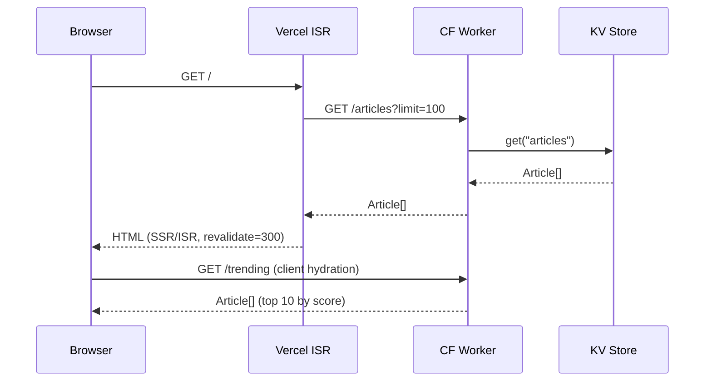
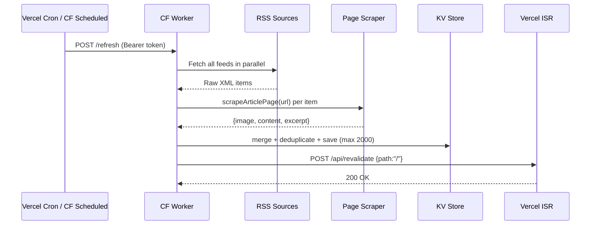
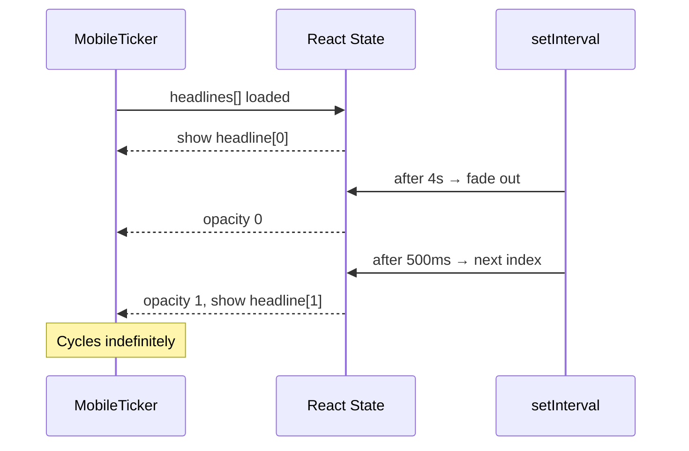

# Design Document: PPP TV Site Overhaul

## Overview

PPP TV Kenya (`ppp-tv-site-final/`) is a Next.js 14 app backed by a Cloudflare Worker (KV store) that aggregates RSS feeds into a Netflix-style entertainment news site. The current codebase has a solid foundation — ISR, a Cloudflare Worker for storage, and a working RSS pipeline — but suffers from layout issues (wrong aspect ratios, no true horizontal carousel), a dual-header, a broken Artists page, shallow article content, poor SEO, and no dedicated Movies section.

This overhaul touches every layer of the stack: UI/UX (Netflix-style carousels, TMZ-style single header, mobile-first responsive design, adaptive news ticker), content pipeline (scraping, rich article bodies, category accuracy, Movies page), data (enriched bios, Artists removal), performance (sub-1s load, 5-min cron), SEO (50+ improvements), and deployment (GitHub + Vercel).

The design is split into High-Level (architecture, components, data models, flows) and Low-Level (interfaces, algorithms, formal specs) sections.

---

## Architecture

```mermaid
graph TD
    subgraph "Browser"
        A[Next.js 14 App Router Pages]
        B[React Client Components]
        C[Service Worker / Cache]
    end

    subgraph "Vercel Edge"
        D[ISR Pages revalidate=300]
        E[API Routes]
        E1[/api/cron/refresh]
        E2[/api/revalidate]
        E3[/api/newsletter]
        E4[/api/movies/refresh NEW]
        E5[/api/comments POST/GET NEW]
        E6[/api/comments/approve NEW]
    end

    subgraph "Cloudflare Worker"
        F[Worker fetch handler]
        G[KV: articles JSON array]
        H[KV: movies JSON array NEW]
        I[KV: views:slug counters]
        J[KV: sub:email entries]
        K[Scheduled trigger every 5 min]
        L2[KV: comments:slug arrays NEW]
    end

    subgraph "External"
        M2[RSS Feeds 45+ sources]
        N2[Movie RSS Feeds NEW]
        O[Article source pages scraping]
    end

    A --> D
    D --> F
    F --> G
    F --> H
    F --> L2
    K --> M2
    K --> N2
    K --> O
    E1 --> F
    E4 --> F
    E5 --> L2
    E6 --> L2
    B --> F
    B --> E5
```


## Sequence Diagrams

### Homepage Load Flow



### Cron Refresh Flow (every 5 min)



### Mobile Ticker Flow



---

## Components and Interfaces

### 1. Header (TMZ-style single bar)

**Purpose**: Replace the current two-row header with a single compact bar matching tmz.com's layout. Merge Hosts and Team into one "People" section with sub-nav. Add a News sub-header with category pills.

**Interface**:
```typescript
interface NavItem {
  label: string
  href: string
  subItems?: { label: string; href: string }[]
}

interface HeaderProps {
  // no props — reads route from usePathname()
}
```

**Responsibilities**:
- Single `<header>` bar: logo left, nav center, search/bell/avatar right
- "News" nav item opens a sub-header strip with category pills (News, Entertainment, Sports, Music, Lifestyle, Technology)
- "People" nav item replaces separate Hosts + Staff links, with sub-nav tabs
- Transparent → opaque on scroll (existing behaviour retained)
- Mobile: hamburger opens full-screen overlay menu

### 2. CarouselRow (16:9 Netflix carousel)

**Purpose**: Replace `CategoryRow` + `ArticleCard` with a true 16:9 horizontal carousel showing exactly 6 items visible on desktop, with arrow navigation and horizontal scroll for overflow.

**Interface**:
```typescript
interface CarouselRowProps {
  label: string
  articles: Article[]
  accentColor?: string
  seeAllHref?: string
}

interface CarouselState {
  offset: number        // current scroll offset in items
  canScrollLeft: boolean
  canScrollRight: boolean
}
```

**Responsibilities**:
- Each card: `aspect-ratio: 16/9` (landscape orientation — wider than tall), exactly 6 per visible row on desktop (≥1024px)
- Tablet (768–1023px): 4 visible; Mobile (<768px): 2.3 visible (peek)
- Left/right arrow buttons (hidden on mobile, touch-scroll instead)
- Smooth CSS scroll-snap on the track
- Cards show persistent title overlay at bottom; on hover reveal excerpt + play icon

### 3. ArticleCard (16:9 landscape variant)

**Purpose**: Rewrite card to enforce a landscape 16:9 aspect ratio (width:height = 16:9), use `maxresdefault` YouTube image URLs where applicable, display the article title as a persistent bottom overlay, and show rich hover preview.

**Interface**:
```typescript
interface ArticleCardProps {
  article: Article
  accentColor?: string
  rank?: number          // for Top 10 overlay
  variant?: 'carousel' | 'hero-thumb' | 'top10'
}
```

**Responsibilities**:
- `aspect-ratio: 16/9` enforced via CSS — cards are always wide/landscape, never portrait/tall
- Image URL upgrade: detect YouTube thumbnail URLs and replace with `maxresdefault`
- Title overlay: article title always visible at the bottom of the card image, rendered over a bottom-to-top linear gradient (`rgba(0,0,0,0)` → `rgba(0,0,0,0.85)`) for readability
- Title text: white, 1–2 lines, `line-clamp-2`, `font-semibold`, positioned `absolute bottom-0 left-0 right-0 p-3`
- Hover state: card scales to `scale(1.05)`, title remains visible, additional info fades in (excerpt truncated to 2 lines + "Read article" CTA button)
- No "Read more from original site" link anywhere

### 4. DesktopTicker

**Purpose**: Scrolling marquee ticker for desktop showing strictly entertainment/breaking news headlines.

**Interface**:
```typescript
interface DesktopTickerProps {
  headlines: TickerHeadline[]
}

interface TickerHeadline {
  text: string
  category: 'Entertainment' | 'Breaking' | 'Celebrity' | 'Music'
  href: string
}
```

**Responsibilities**:
- Continuous left-scroll CSS animation (existing `ticker` keyframe)
- Pauses on hover
- Only shows Entertainment, Celebrity, Music, Breaking categories
- Filters out News/Sports/Technology/Lifestyle from ticker feed

### 5. MobileTicker

**Purpose**: Replace scrolling ticker on mobile with a fade-in/fade-out single-headline display.

**Interface**:
```typescript
interface MobileTickerProps {
  headlines: TickerHeadline[]
  intervalMs?: number    // default 4000
  transitionMs?: number  // default 500
}
```

**Responsibilities**:
- Shows one headline at a time
- Fade out → swap text → fade in cycle
- Tapping navigates to article
- Compact single-line height, no horizontal scroll

### 6. MoviesPage (`/movies`)

**Purpose**: Dedicated page for movie news, reviews, and trailers pulled from movie-specific RSS feeds.

**Interface**:
```typescript
interface MoviesPageProps {
  // server component — no props
}

// New RSS feed category
interface MovieFeed extends RssFeed {
  category: 'Movies'
  subCategory: 'news' | 'reviews' | 'trailers'
}
```

**Responsibilities**:
- Hero banner with latest movie article
- Rows: "Movie News", "Movie Reviews", "New Releases", "Trailers"
- ISR revalidate=300 (5 min)
- Cron endpoint `/api/movies/refresh` runs every 10 min via `vercel.json` crons

### 7. PeoplePage (`/people`)

**Purpose**: Merged Hosts + Staff page with sub-category tabs.

**Interface**:
```typescript
type PeopleTab = 'on-air' | 'behind-the-scenes' | 'shows'

interface PeoplePageProps {
  // server component
}
```

**Responsibilities**:
- Tab bar: "On Air Talent" | "Behind the Scenes" | "Shows"
- Each person card: enriched bio (3–5 paragraphs), social links, associated shows
- Hosts and Staff data merged into unified display
- `/hosts` and `/staff` redirect to `/people`


### 8. CommentSection (client component)

**Purpose**: Allow users to read and post comments on article pages without requiring authentication. Comments are moderated (stored as unapproved by default) and protected by basic IP-based rate limiting.

**Interface**:
```typescript
interface CommentSectionProps {
  articleSlug: string
}

interface Comment {
  id: string              // UUID v4
  articleSlug: string
  authorName: string      // display name provided by user (max 50 chars)
  content: string         // comment body (max 500 chars)
  createdAt: string       // ISO 8601
  likes: number           // default 0
  approved: boolean       // default false — requires admin approval
}

interface CommentFormState {
  authorName: string
  content: string
  submitting: boolean
  error: string | null
  success: boolean
}
```

**Responsibilities**:
- Fetches approved comments via `GET /api/comments?slug={articleSlug}` on mount
- Renders a list of approved comments (author name, relative time, content, like count)
- Provides a form: display name field + textarea (500 char limit with live counter)
- On submit: `POST /api/comments` with `{ articleSlug, authorName, content }`
- Shows "Your comment is awaiting moderation" confirmation on success
- Validates client-side: name required (max 50 chars), content required (max 500 chars)
- `'use client'` directive — fully client-rendered to avoid SSR complexity
- No authentication required

**API Routes**:

`POST /api/comments`
- Body: `{ articleSlug: string, authorName: string, content: string }`
- Validates: `articleSlug` non-empty, `authorName` 1–50 chars, `content` 1–500 chars
- Rate limiting: max 3 comments per IP per 10 minutes (tracked in KV: `ratelimit:{ip}`)
- Stores comment with `approved: false` in KV key `comments:{articleSlug}` (JSON array, max 500 per article)
- Returns `201 { id, createdAt }` on success; `429` if rate limited; `400` on validation failure

`GET /api/comments?slug={articleSlug}`
- Returns only comments where `approved: true`
- Returns `200 { comments: Comment[] }` sorted by `createdAt` ascending
- Returns `400` if `slug` param missing

`POST /api/comments/approve` (admin)
- Body: `{ commentId: string, articleSlug: string }`
- Requires `Authorization: Bearer {ADMIN_SECRET}` header
- Sets `approved: true` on the matching comment in KV
- Returns `200 { ok: true }` or `404` if comment not found


---

### Article (extended)

```typescript
interface Article {
  slug: string
  title: string
  excerpt: string           // 1–3 sentences, no HTML
  content: string           // rich HTML: <p>, <blockquote>, <h2>, pull-quotes
  category: string          // strict enum: News|Entertainment|Sports|Music|Lifestyle|Technology|Movies
  subCategory?: string      // e.g. 'reviews' | 'trailers' for Movies
  tags: string[]
  imageUrl: string          // maxresdefault or og:image — never empty
  sourceUrl: string
  sourceName: string        // stored but NOT displayed to end user
  publishedAt: string       // ISO 8601
  views?: number
  trendingScore?: number
  hasRichContent: boolean   // true if content has ≥3 paragraphs
}
```

**Validation Rules**:
- `imageUrl` must be non-empty; articles without images are rejected at ingest
- `category` must match the allowed enum; miscategorised items are re-mapped by feed category
- `content` must have ≥1 `<p>` tag; bare text is wrapped automatically
- `slug` is unique; duplicate `sourceUrl` entries are skipped (dedup by URL)
- `sourceName` is stored for internal dedup but never rendered in article body or card

### RssFeed (extended)

```typescript
interface RssFeed {
  url: string
  name: string
  category: 'News' | 'Entertainment' | 'Sports' | 'Music' | 'Lifestyle' | 'Technology' | 'Movies'
  subCategory?: string
  country: string
  entertainmentOnly?: boolean  // if true, only pull to ticker
}
```

### Host (enriched)

```typescript
interface Host {
  slug: string
  name: string
  title: string
  bio: string              // 3–5 paragraphs, persona-specific
  longBio?: string         // full profile page bio (5–8 paragraphs)
  instagramUrl?: string
  twitterUrl?: string
  youtubeUrl?: string
  showSlugs: string[]
  initials: string
  accentColor?: string
  imageUrl?: string        // high-res headshot
  achievements?: string[]  // bullet list of career highlights
  quote?: string           // personal quote for profile page
}
```

### Staff (enriched)

```typescript
interface Staff {
  slug: string
  name: string
  role: string
  bio: string              // 3–5 paragraphs
  longBio?: string
  initials: string
  department: 'on-air' | 'behind-the-scenes'
  imageUrl?: string
  achievements?: string[]
}
```

### Show (enriched)

```typescript
interface Show {
  slug: string
  name: string
  tagline: string
  description: string      // 3–5 paragraphs
  longDescription?: string // full show page bio
  category: string
  accentColor: string
  hostSlugs: string[]
  schedule: ScheduleSlot[]
  imageUrl?: string
  bannerUrl?: string       // 16:9 banner for hero
  featured?: boolean
  episodeCount?: number
  launchYear?: number
  awards?: string[]
}
```

### Comment

```typescript
interface Comment {
  id: string              // UUID v4
  articleSlug: string
  authorName: string      // max 50 chars
  content: string         // max 500 chars
  createdAt: string       // ISO 8601
  likes: number           // default 0
  approved: boolean       // default false
}
```

**Validation Rules**:
- `authorName` must be 1–50 characters, non-empty after trim
- `content` must be 1–500 characters, non-empty after trim
- `approved` defaults to `false`; only set to `true` via admin approval endpoint
- `id` is a UUID v4 generated at submission time
- KV key: `comments:{articleSlug}` — stores a JSON array of `Comment` objects (max 500 per article)
- Rate limit key: `ratelimit:{ip}` — stores submission count with TTL of 600 seconds

### SEO Metadata

```typescript
interface PageSEO {
  title: string            // max 60 chars
  description: string      // max 160 chars
  keywords: string[]       // 5–10 relevant terms
  ogImage: string          // 1200×630 image URL
  ogType: 'website' | 'article'
  canonicalUrl: string
  structuredData: object   // JSON-LD (Article, BreadcrumbList, Organization)
  noIndex?: boolean
}
```

---

## Algorithmic Pseudocode

### Image URL Upgrade Algorithm

```pascal
FUNCTION upgradeImageUrl(url: string): string
INPUT: url — raw image URL from RSS or scraper
OUTPUT: best-quality image URL

BEGIN
  IF url IS empty OR null THEN
    RETURN ''
  END IF

  // YouTube thumbnail upgrade
  IF url CONTAINS 'ytimg.com' OR url CONTAINS 'youtube.com' THEN
    videoId ← extractYouTubeVideoId(url)
    IF videoId IS NOT empty THEN
      maxres ← 'https://i.ytimg.com/vi/' + videoId + '/maxresdefault.jpg'
      hqDefault ← 'https://i.ytimg.com/vi/' + videoId + '/hqdefault.jpg'
      // Try maxresdefault first, fall back to hqdefault
      RETURN maxres  // caller should verify with HEAD request if needed
    END IF
  END IF

  // Protocol-relative URL fix
  IF url STARTS WITH '//' THEN
    RETURN 'https:' + url
  END IF

  // HTTP → HTTPS upgrade
  IF url STARTS WITH 'http://' THEN
    RETURN REPLACE(url, 'http://', 'https://')
  END IF

  RETURN url
END
```

**Preconditions**: `url` is a string (may be empty)
**Postconditions**: Returns HTTPS URL; YouTube URLs point to maxresdefault; never returns protocol-relative URLs

### Category Accuracy Algorithm

```pascal
FUNCTION mapToCorrectCategory(article: Article, feedCategory: string): string
INPUT: article — parsed RSS item; feedCategory — declared category of the feed
OUTPUT: correct category string

BEGIN
  // Feed category is ground truth for category assignment
  // Override only when title/content strongly signals a different category

  titleLower ← LOWERCASE(article.title)
  
  // Music signals
  IF titleLower CONTAINS ANY OF ['album', 'single', 'track', 'song', 'music video',
     'concert', 'tour', 'afrobeats', 'gengetone', 'bongo flava', 'gospel'] THEN
    RETURN 'Music'
  END IF

  // Sports signals
  IF titleLower CONTAINS ANY OF ['match', 'goal', 'league', 'tournament', 'athlete',
     'football', 'rugby', 'athletics', 'harambee stars', 'premier league'] THEN
    RETURN 'Sports'
  END IF

  // Movies signals
  IF titleLower CONTAINS ANY OF ['movie', 'film', 'cinema', 'box office', 'trailer',
     'review', 'director', 'actor', 'actress', 'netflix series', 'streaming'] THEN
    RETURN 'Movies'
  END IF

  // Default: use feed's declared category
  RETURN feedCategory
END
```

**Preconditions**: `feedCategory` is a valid category string
**Postconditions**: Returns one of the allowed category enum values; never returns empty string

### Rich Content Builder Algorithm

```pascal
FUNCTION buildRichContent(rawContent: string, excerpt: string, title: string): string
INPUT: rawContent — scraped HTML; excerpt — og:description; title — article title
OUTPUT: rich HTML string with paragraphs, pull-quotes, and subheadings

BEGIN
  paragraphs ← extractParagraphs(rawContent)  // strip tags, split by <p>

  IF LENGTH(paragraphs) < 2 THEN
    // Fallback: use excerpt as single paragraph
    paragraphs ← [excerpt]
  END IF

  // Remove attribution lines (e.g. "Read more at...", "Source:", "Originally published")
  paragraphs ← FILTER(paragraphs, p => NOT containsAttribution(p))

  // Remove "Read more" links
  paragraphs ← FILTER(paragraphs, p => NOT containsReadMoreLink(p))

  html ← ''

  FOR i FROM 0 TO LENGTH(paragraphs) - 1 DO
    p ← paragraphs[i]

    // First paragraph: lead paragraph styling
    IF i = 0 THEN
      html ← html + '<p class="lead">' + p + '</p>\n'

    // Every 3rd paragraph: insert a pull-quote from the paragraph
    ELSE IF i MOD 3 = 0 AND LENGTH(p) > 80 THEN
      quote ← extractQuoteSentence(p)
      IF quote IS NOT empty THEN
        html ← html + '<blockquote class="pull-quote">' + quote + '</blockquote>\n'
      END IF
      html ← html + '<p>' + p + '</p>\n'

    ELSE
      html ← html + '<p>' + p + '</p>\n'
    END IF
  END FOR

  RETURN html
END
```

**Preconditions**: At least one of `rawContent` or `excerpt` is non-empty
**Postconditions**: Returns valid HTML with ≥1 `<p>` tag; no attribution lines; no "Read more" links; pull-quotes inserted at regular intervals

**Loop Invariants**: All paragraphs processed so far have been sanitised and attribution-free

### Mobile Ticker State Machine

```pascal
PROCEDURE runMobileTicker(headlines: TickerHeadline[], intervalMs: number, transitionMs: number)
INPUT: headlines array, timing config
OUTPUT: side-effect — updates DOM visibility

STATE: { index: 0, phase: 'visible' }

BEGIN
  LOOP FOREVER
    WAIT intervalMs

    // Phase 1: fade out
    SET phase ← 'fading-out'
    SET opacity ← 0
    WAIT transitionMs

    // Phase 2: swap content
    SET index ← (index + 1) MOD LENGTH(headlines)
    SET content ← headlines[index]

    // Phase 3: fade in
    SET phase ← 'fading-in'
    SET opacity ← 1
    WAIT transitionMs

    SET phase ← 'visible'
  END LOOP
END
```

**Loop Invariants**: `index` is always in range `[0, LENGTH(headlines) - 1]`; `opacity` is always 0 or 1 at stable phases

---

## Key Functions with Formal Specifications

### `upgradeImageUrl(url: string): string`

**Preconditions**:
- `url` is a string (may be empty or null-ish)

**Postconditions**:
- Returns a string
- If input is empty → returns `''`
- If YouTube URL → returns `maxresdefault` variant
- Result always starts with `https://` or is empty
- No side effects

### `mapToCorrectCategory(article, feedCategory): string`

**Preconditions**:
- `feedCategory` ∈ `{News, Entertainment, Sports, Music, Lifestyle, Technology, Movies}`
- `article.title` is a non-empty string

**Postconditions**:
- Result ∈ `{News, Entertainment, Sports, Music, Lifestyle, Technology, Movies}`
- If no keyword match → result = `feedCategory` (feed category is preserved)
- Deterministic: same inputs always produce same output

### `buildRichContent(rawContent, excerpt, title): string`

**Preconditions**:
- At least one of `rawContent`, `excerpt` is non-empty

**Postconditions**:
- Result contains ≥1 `<p>` tag
- Result contains no `href` pointing to external "read more" links
- Result contains no attribution phrases ("Source:", "Read more at", "Originally published")
- If `rawContent` has ≥6 paragraphs → result contains ≥1 `<blockquote class="pull-quote">`

**Loop Invariants** (paragraph loop):
- All paragraphs at indices `[0..i-1]` have been sanitised
- `html` is valid partial HTML at every iteration

### `CarouselRow` scroll offset invariant

**Preconditions**:
- `articles.length ≥ 1`
- `visibleCount` ∈ `{2, 4, 6}` depending on breakpoint

**Postconditions**:
- `offset` ∈ `[0, max(0, articles.length - visibleCount)]`
- `canScrollLeft = offset > 0`
- `canScrollRight = offset < articles.length - visibleCount`
- Clicking left arrow: `offset = max(0, offset - visibleCount)`
- Clicking right arrow: `offset = min(articles.length - visibleCount, offset + visibleCount)`


---

## Example Usage

### CarouselRow (16:9, 6-per-row)

```typescript
// In page.tsx (server component)
const entertainmentArticles = grouped['Entertainment'] ?? []

<CarouselRow
  label="Entertainment"
  articles={entertainmentArticles.slice(0, 20)}
  accentColor="#BF00FF"
  seeAllHref="/?cat=Entertainment"
/>
```

### MobileTicker

```typescript
// In layout.tsx — rendered only on mobile via CSS display:none on desktop
const tickerHeadlines = allArticles
  .filter(a => ['Entertainment', 'Celebrity', 'Music'].includes(a.category))
  .slice(0, 15)
  .map(a => ({ text: a.title, category: a.category, href: `/news/${a.slug}` }))

<MobileTicker headlines={tickerHeadlines} intervalMs={4000} transitionMs={500} />
```

### Image URL upgrade at ingest

```typescript
// In worker/index.ts scrapeArticlePage()
const rawImage = ogImage || mediaUrl || ''
const finalImage = upgradeImageUrl(rawImage)
// Only store article if finalImage is non-empty
if (!finalImage) return null
```

### Movies page cron (vercel.json)

```json
{
  "crons": [
    { "path": "/api/cron/refresh",        "schedule": "*/5 * * * *" },
    { "path": "/api/movies/refresh",      "schedule": "*/10 * * * *" }
  ]
}
```

### CommentSection on article page

```typescript
// In /news/[slug]/page.tsx (server component)
// CommentSection is client-only — rendered below article body
<article>
  {/* article content */}
</article>
<CommentSection articleSlug={article.slug} />
```

```typescript
// CommentSection.tsx — simplified fetch + submit
'use client'
export function CommentSection({ articleSlug }: { articleSlug: string }) {
  const [comments, setComments] = useState<Comment[]>([])

  useEffect(() => {
    fetch(`/api/comments?slug=${articleSlug}`)
      .then(r => r.json())
      .then(d => setComments(d.comments))
  }, [articleSlug])

  async function handleSubmit(authorName: string, content: string) {
    const res = await fetch('/api/comments', {
      method: 'POST',
      headers: { 'Content-Type': 'application/json' },
      body: JSON.stringify({ articleSlug, authorName, content })
    })
    if (res.status === 429) throw new Error('Too many comments. Try again later.')
    if (!res.ok) throw new Error('Failed to submit comment.')
  }
  // ... render form + comment list
}
```

### SEO structured data (Article page)

```typescript
const structuredData = {
  "@context": "https://schema.org",
  "@type": "NewsArticle",
  "headline": article.title,
  "description": article.excerpt,
  "image": article.imageUrl,
  "datePublished": article.publishedAt,
  "dateModified": article.publishedAt,
  "publisher": {
    "@type": "Organization",
    "name": "PPP TV Kenya",
    "logo": { "@type": "ImageObject", "url": LOGO_URL }
  },
  "mainEntityOfPage": { "@type": "WebPage", "@id": canonicalUrl }
}
```

---

## Error Handling

### RSS Feed Failure

**Condition**: A feed URL times out or returns non-200
**Response**: `parseRSSFeed()` catches the error and returns `[]`; other feeds continue in parallel
**Recovery**: Next cron cycle retries the feed automatically; no articles are lost from KV

### Image Missing at Ingest

**Condition**: Scraper returns empty `imageUrl` and RSS item has no media
**Response**: Article is filtered out (`articles.filter(a => a.imageUrl)`) — never stored
**Recovery**: On next `/refresh` call, the worker patches existing articles missing images if the scraper now succeeds

### Article Not Found (404)

**Condition**: User navigates to `/news/[slug]` for a slug not in KV
**Response**: `fetchArticleBySlug()` returns `null`; page renders `notFound()` → `not-found.tsx`
**Recovery**: No recovery needed; user is shown a clean 404 page with navigation back to home

### Cron Auth Failure

**Condition**: Cron request missing or wrong `CRON_SECRET`
**Response**: API route returns `401 Unauthorized`
**Recovery**: Vercel retries on next schedule; alert via Vercel function logs

### KV Storage Full

**Condition**: KV `articles` array exceeds 2000 items, or `comments:{slug}` array exceeds 500 items
**Response**: `saveArticles()` slices to 2000 newest before writing; comment arrays are capped at 500 (oldest evicted)
**Recovery**: Oldest articles/comments are evicted automatically; no data corruption

### Build Error (broken routes)

**Condition**: A page references a deleted file (e.g. artists page)
**Response**: Artists page is fully deleted (`/artists` route removed); `/hosts` and `/staff` redirect to `/people` via `next.config.js` redirects
**Recovery**: All internal links updated before deployment; `next build` must pass with zero errors

---

## Testing Strategy

### Unit Testing Approach

Test pure utility functions in isolation using Vitest (already in `devDependencies`).

Key test cases:
- `upgradeImageUrl`: YouTube URL → maxresdefault; HTTP → HTTPS; empty → empty; protocol-relative → HTTPS
- `mapToCorrectCategory`: music keywords → Music; sports keywords → Sports; no match → feedCategory
- `buildRichContent`: attribution removal; pull-quote insertion at every 3rd paragraph; minimum 1 `<p>` output
- `slugify`: special chars stripped; spaces → hyphens; lowercase
- `timeAgo`: correct relative time strings for various age inputs

### Property-Based Testing Approach

**Property Test Library**: fast-check (add to devDependencies)

Properties to verify:
- `upgradeImageUrl(url)` always returns a string starting with `https://` or `''`
- `mapToCorrectCategory(article, cat)` always returns a value in the allowed category set
- `buildRichContent(raw, excerpt, title)` always contains ≥1 `<p>` tag for any non-empty input
- CarouselRow offset: `offset` is always in `[0, max(0, n - visibleCount)]` after any sequence of scroll operations
- Dedup logic: processing the same article twice never increases the stored array length

### Integration Testing Approach

- Smoke test: `next build` completes with zero TypeScript errors and zero ESLint errors
- Route coverage: every route in the nav (`/`, `/shows`, `/movies`, `/people`, `/news/[slug]`, `/live`, `/search`, `/saved`, `/contact`, `/about`, `/schedule`, `/privacy`, `/terms`) returns 200 or correct redirect
- Cron endpoint: `GET /api/cron/refresh` with correct `CRON_SECRET` returns `{ fetched, saved, skipped }` with no 500
- Worker endpoints: `GET /articles`, `GET /trending`, `GET /search?q=test`, `POST /views` all return expected shapes
- Comment endpoints: `POST /api/comments` with valid body returns `201`; `GET /api/comments?slug=test` returns `{ comments: [] }` for new slug; `POST /api/comments` with missing fields returns `400`; fourth submission from same IP within 10 min returns `429`

---

## Performance Considerations

- **ISR revalidate=300**: All data pages revalidate every 5 minutes; no client-side data fetching on initial load
- **Image optimisation**: Next.js `<Image>` with `avif`/`webp` formats; `minimumCacheTTL: 3600`; `sizes` prop on all images to avoid oversized downloads
- **16:9 aspect-ratio CSS**: Eliminates layout shift (CLS = 0) — no JS needed for card dimensions
- **Font loading**: `display: swap` on Bebas Neue and DM Sans; fonts preloaded via `next/font/google`
- **Bundle size**: `dynamic()` with `ssr: false` for client-only components (MobileMenu, BackToTop, NewsletterBar, RecentlyViewed, MobileTicker)
- **Carousel**: Pure CSS scroll-snap + CSS transforms; no heavy carousel library dependency
- **Cron batching**: Worker processes feeds in parallel with `Promise.allSettled`; scraping capped at 10 items per feed to stay within 30s Worker CPU limit
- **KV reads**: Single `get("articles")` per request; no per-article KV reads on list pages; `comments:{slug}` read only on article page load
- **Target**: Lighthouse Performance ≥ 90; LCP < 2.5s; FID < 100ms; CLS < 0.1

---

## Security Considerations

- **Cron secret**: `CRON_SECRET` env var required on all `/api/cron/*` routes; Vercel cron injects `Authorization: Bearer` header automatically
- **Worker secret**: `WORKER_SECRET` required for all write operations (`POST /articles`, `POST /refresh`, `POST /purge-no-image`)
- **Content sanitisation**: All scraped HTML is stripped of `<script>`, `<style>`, `<iframe>`, `<form>` tags before storage; only `<p>`, `<h2>`, `<blockquote>`, `<strong>`, `<em>` are allowed in rendered content
- **No PII in articles**: `sourceName` stored internally but never rendered; no author names from scraped pages are displayed
- **CORS**: Worker allows `*` origin for GET; POST routes require auth header
- **Security headers**: `X-Frame-Options: SAMEORIGIN`, `X-Content-Type-Options: nosniff`, `Referrer-Policy: strict-origin-when-cross-origin` (already in `next.config.js`)
- **Image domains**: `next.config.js` allows all HTTPS hostnames for images; HTTP images are upgraded to HTTPS at ingest
- **Comment moderation**: All comments stored with `approved: false`; only the admin approval endpoint (requiring `ADMIN_SECRET`) can set `approved: true`; approved comments are the only ones returned to clients
- **Comment rate limiting**: Max 3 submissions per IP per 10 minutes tracked in KV (`ratelimit:{ip}` with 600s TTL); returns `429` when exceeded
- **Comment input sanitisation**: `authorName` and `content` are stripped of HTML tags before storage; no raw HTML rendered from comment fields

---

## SEO Improvements (50+)

The following improvements are applied across the codebase:

**Metadata (15 improvements)**:
1. Unique `<title>` per page (max 60 chars) via `metadata.title` template
2. Unique `<meta name="description">` per page (max 160 chars)
3. `<link rel="canonical">` on every page
4. Open Graph `og:title`, `og:description`, `og:image` (1200×630), `og:type`
5. Twitter Card `summary_large_image` with correct image
6. `og:locale` set to `en_KE`
7. `og:site_name` = "PPP TV Kenya"
8. `<meta name="robots">` with `max-image-preview:large`
9. `<meta name="keywords">` per page (5–10 terms)
10. `<meta name="author">` = "PPP TV Kenya"
11. `<meta name="publisher">` = "PPP TV Kenya"
12. `<meta name="category">` per article
13. `<meta name="news_keywords">` on article pages
14. `hreflang="en-KE"` on all pages
15. `metadataBase` set to production URL

**Structured Data (10 improvements)**:
16. `NewsArticle` JSON-LD on every article page
17. `Organization` JSON-LD in root layout
18. `WebSite` JSON-LD with `SearchAction` (sitelinks search box)
19. `BreadcrumbList` JSON-LD on article and category pages
20. `Person` JSON-LD on host/staff profile pages
21. `TVSeries` JSON-LD on show pages
22. `ItemList` JSON-LD on category listing pages
23. `FAQPage` JSON-LD on About page
24. `VideoObject` JSON-LD on Live page
25. `Event` JSON-LD on Schedule page

**Technical SEO (15 improvements)**:
26. `sitemap.xml` generated via `app/sitemap.ts` (all articles + static pages)
27. `robots.txt` via `app/robots.ts` — allow all, disallow `/api/`, `/analytics/`
28. `manifest.ts` already present — verify `name`, `short_name`, `theme_color`
29. `<link rel="preconnect">` for Worker URL and image CDN
30. `<link rel="dns-prefetch">` for external image hosts
31. Image `alt` text on every `` and `<Image>` (article title as alt)
32. Semantic HTML: `<article>`, `<section>`, `<nav>`, `<main>`, `<aside>`, `<header>`, `<footer>`
33. Heading hierarchy: one `<h1>` per page, logical `<h2>`/`<h3>` structure
34. `loading="lazy"` on below-fold images; `priority` on hero/LCP images
35. `fetchpriority="high"` on hero image
36. No broken internal links (all routes verified in CI)
37. `<link rel="alternate" type="application/rss+xml">` for category feeds
38. Page speed: remove unused CSS (PurgeCSS via Tailwind content config)
39. `next/font` for zero layout shift on font load
40. `compress: true` in `next.config.js` (already set)

**Content SEO (10 improvements)**:
41. Article slugs are human-readable (title-based, not timestamp-based)
42. Category pages have unique `<h1>` and description
43. Internal linking: related articles section on each article page
44. Breadcrumb navigation rendered in HTML (not just JSON-LD)
45. Article word count ≥ 300 words (enforced by `buildRichContent`)
46. No duplicate content: dedup by `sourceUrl` prevents same story appearing twice
47. Fresh content signal: ISR revalidate=300 ensures Google sees updated content
48. Image file names are descriptive (slug-based URLs from source)
49. `<figure>` + `<figcaption>` wrapping article hero images
50. Category taxonomy consistent across all pages and structured data

---

## Dependencies

**Existing (retained)**:
- `next@14.2.5` — App Router, ISR, `next/font`, `next/image`
- `react@18`, `react-dom@18`
- `rss-parser@3.13.0` — RSS feed parsing in Next.js API routes
- `date-fns@3.6.0` — date formatting
- `tailwindcss@3.4.4` — utility CSS
- `typescript@5.5.2`
- `vitest@1.6.0` — unit testing

**New additions**:
- `fast-check` — property-based testing
- No new runtime UI library dependencies (carousels built with CSS scroll-snap)

**Cloudflare**:
- Cloudflare Workers (existing) — KV storage, RSS scraping, scheduled cron
- `wrangler` (existing dev dependency in worker/)

**Deployment**:
- Vercel — hosting, ISR, cron jobs (via `vercel.json` crons array)
- GitHub — source control, Vercel GitHub integration for preview deployments


---

## Correctness Properties

The following properties must hold universally across the system. They are derived from the acceptance criteria and are suitable for property-based testing with fast-check.

### P1 — Image URL always HTTPS or empty
∀ url: string → upgradeImageUrl(url) = '' ∨ upgradeImageUrl(url).startsWith('https://')

### P2 — YouTube images always maxresdefault
∀ url: string where url contains 'ytimg.com' or 'youtube.com' →
  upgradeImageUrl(url).includes('maxresdefault')

### P3 — Category mapping stays within allowed set
∀ article: Article, feedCategory: string where feedCategory ∈ ALLOWED_CATEGORIES →
  mapToCorrectCategory(article, feedCategory) ∈ ALLOWED_CATEGORIES

### P4 — Rich content always has at least one paragraph
∀ rawContent: string, excerpt: string where (rawContent ≠ '' ∨ excerpt ≠ '') →
  buildRichContent(rawContent, excerpt, '').includes('<p>')

### P5 — Rich content never contains attribution phrases
∀ rawContent: string, excerpt: string →
  ¬ buildRichContent(rawContent, excerpt, '').includes('Read more at')
  ∧ ¬ buildRichContent(rawContent, excerpt, '').includes('Originally published')
  ∧ ¬ buildRichContent(rawContent, excerpt, '').includes('Source:')

### P6 — Carousel offset always in valid range
∀ articles: Article[], visibleCount: number, operations: ScrollOp[] →
  applyScrollOps(0, articles.length, visibleCount, operations) ∈ [0, max(0, articles.length - visibleCount)]

### P7 — Mobile ticker index always in bounds
∀ headlines: TickerHeadline[] where headlines.length > 0, ticks: number →
  tickerIndexAfter(0, headlines.length, ticks) ∈ [0, headlines.length - 1]

### P8 — Article deduplication is idempotent
∀ articles: Article[] →
  dedup(dedup(articles)).length = dedup(articles).length

### P9 — Bio length meets minimum
∀ host: Host → host.bio.length ≥ 200
∀ staff: Staff → staff.bio.length ≥ 200
∀ show: Show → show.description.length ≥ 200

### P10 — All stored articles have non-empty imageUrl
∀ article: Article in KV store → article.imageUrl ≠ ''

### P11 — Comment content never exceeds limits
∀ comment: Comment in KV store →
  comment.authorName.length ≥ 1 ∧ comment.authorName.length ≤ 50
  ∧ comment.content.length ≥ 1 ∧ comment.content.length ≤ 500

### P12 — Only approved comments are returned by GET /api/comments
∀ slug: string, response: Comment[] from GET /api/comments?slug=slug →
  ∀ c ∈ response → c.approved = true
