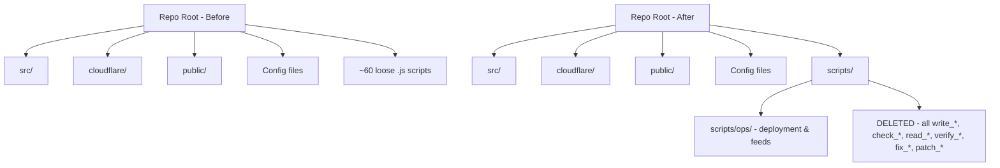

# Design Document: repo-cleanup

## Overview

The repository root is cluttered with ~60 one-off Node.js scripts that were used during development to write files, patch code, inspect state, and deploy changes. These scripts have no place in a production Next.js repo root and need to be either organized into a proper `scripts/` folder or deleted entirely. The goal is a clean root that only contains standard project config files and the canonical source directories (`src/`, `cloudflare/`, `public/`).

## Architecture



## Script Inventory and Categorization

After reviewing every file, the scripts fall into these categories:

### Category A: Temporary Code-Writers (DELETE)

These scripts exist solely to `fs.writeFileSync` source code into the repo. They were used as a workaround to write large files during development sessions. The files they wrote already exist in `src/` — keeping these scripts is redundant and confusing.

| File | What it wrote |
|------|--------------|
| `build_page.js` | `src/app/page.tsx` |
| `write_page.js` | `src/app/page.tsx` (earlier version) |
| `write_page_v3.js` | `src/app/page.tsx` (v3) |
| `write_page_video.js` | `src/app/video/page.tsx` |
| `write_page_video2.js` | `src/app/video/page.tsx` (v2) |
| `write_page_video3.js` | `src/app/video/page.tsx` (v3) |
| `write_dashboard.js` | Dashboard page |
| `write_dashboard_final.js` | Dashboard page (final) |
| `write_netflix_dashboard.js` | Netflix-style dashboard |
| `write_netflix_final.js` | Netflix dashboard (final) |
| `write_netflix_v2.js` | Netflix dashboard (v2) |
| `write_scraper.js` | `src/lib/scraper.ts` |
| `write_scraper_fix.js` | `src/lib/scraper.ts` (fix) |
| `write_gemini.js` | `src/lib/gemini.ts` |
| `write_image_gen.js` | `src/lib/image-gen.ts` |
| `write_imagegen_fix.js` | `src/lib/image-gen.ts` (fix) |
| `write_imagegen_v2.js` | `src/lib/image-gen.ts` (v2) |
| `write_publisher.js` | `src/lib/publisher.ts` |
| `write_postlog_route.js` | `src/app/api/post-log/route.ts` |
| `write_posturl_fix.js` | `src/app/api/post-from-url/route.ts` |
| `write_url_fix.js` | URL-related route fix |
| `write_url_poster.js` | URL poster route |
| `write_proxy_and_fix.js` | Proxy route |
| `write_login_fix.js` | Login route fix |
| `write_rate_fix.js` | Rate limiting fix |
| `write_final_fix.js` | Misc final fix |
| `write_comprehensive_fix.js` | Misc comprehensive fix |
| `write_overhaul.js` | Misc overhaul |
| `write_mega_upgrade.js` | Misc mega upgrade |
| `write_fix_ig_and_hours.js` | Instagram + hours fix |
| `write_pwa_gemini_retry.js` | PWA + Gemini retry |
| `write_cron_refresh.js` | Cron refresh route |
| `write_debug.js` | Debug route |
| `write_automate_route.js` | `src/app/api/automate/route.ts` |
| `write_video_page.js` | Video page |
| `write_video_post.js` | Video post route |
| `write_video_publisher.js` | Video publisher |
| `write_worker_throttle.js` | Worker throttle logic |
| `write_task4.js` | Task 4 implementation |
| `write_all_fixes.js` | Batch fix writer |
| `update_auto_news.js` | Rewrote `src/lib/gemini.ts`, `scraper.ts`, `automate/route.ts` |

### Category B: One-Time Patchers (DELETE)

Scripts that patched specific files in-place. The patches have already been applied — these are dead code.

| File | What it patched |
|------|----------------|
| `patch_dedup.js` | `cloudflare/worker.js` — added title-based dedup |
| `patch_dedup2.js` | `cloudflare/worker.js` — dedup follow-up |
| `patch_routes.js` | API routes |
| `fix_worker_syntax.js` | `cloudflare/worker.js` — missing `}` |
| `fix_worker_syntax2.js` | `cloudflare/worker.js` — follow-up syntax fix |
| `fix_both_seen.js` | `/seen` and `/seen/check` handlers |

### Category C: Diagnostic / Inspection Scripts (DELETE)

Scripts that read files and print output to the console for debugging. All one-time use.

| File | What it inspected |
|------|------------------|
| `check_line796.js` | Line 796 of worker.js |
| `check_seen_area.js` | `/seen/check` handler in worker.js |
| `check_seen_area2.js` | `/seen/check` handler (follow-up) |
| `check_seen_post.js` | `/seen` POST handler |
| `check_worker_line.js` | Specific worker.js line |
| `find_getip.js` | `getIP` function in worker.js |
| `read_files.js` | Generic file reader |
| `read_worker.js` | Prints entire worker.js |
| `read_worker_top.js` | Prints top of worker.js |
| `verify_task4.js` | Verified task 4 implementation |

### Category D: Keep — Operational Scripts (MOVE to `scripts/`)

These scripts perform real, repeatable operations that may need to be run again.

| File | Purpose | Move to |
|------|---------|---------|
| `add_feeds.js` | Adds RSS feed entries to `src/lib/rss.ts` | `scripts/ops/add_feeds.js` |
| `deploy_worker_fix.js` | Deploys Cloudflare worker via wrangler | `scripts/ops/deploy_worker.js` |
| `push_news_sitemap.js` | Git add/commit/push for sitemap files | `scripts/ops/push_news_sitemap.js` |

> **Note on `deploy_worker_fix.js`**: This script contains a hardcoded Cloudflare API token and `AUTOMATE_SECRET`. Before keeping it, the secrets must be removed and replaced with environment variable reads. See Security Considerations.

## Target Folder Structure

```
repo-root/
├── scripts/
│   └── ops/
│       ├── add_feeds.js          # Add RSS feeds to rss.ts
│       ├── deploy_worker.js      # Deploy Cloudflare worker (secrets via env)
│       └── push_news_sitemap.js  # Git push sitemap changes
├── src/                          # Next.js app (unchanged)
├── cloudflare/                   # Cloudflare worker (unchanged)
├── public/                       # Static assets (unchanged)
├── next.config.js
├── tailwind.config.ts
├── tsconfig.json
├── package.json
├── vercel.json
└── ...other standard config files
```

## Components and Interfaces

### Decision Criteria: Keep vs Delete

```
FUNCTION shouldKeep(script):
  IF script performs a repeatable operational task (deploy, data migration, git ops):
    RETURN KEEP → move to scripts/ops/
  IF script only writes source code that already exists in src/:
    RETURN DELETE
  IF script patches a file that has already been patched:
    RETURN DELETE
  IF script reads/inspects files for debugging:
    RETURN DELETE
  IF script verifies a one-time task:
    RETURN DELETE
```

**Keep criteria (all must be true):**
- The operation is repeatable (not a one-time fix)
- The script does something that can't be done with an existing npm script
- The output is not already captured in source control

**Delete criteria (any one is sufficient):**
- The script's sole purpose is to write a file that already exists in `src/`
- The script patches code that has already been patched
- The script reads/prints file contents for debugging
- The script verifies a one-time task completion

### `scripts/ops/deploy_worker.js` — Sanitized Version

The current `deploy_worker_fix.js` has hardcoded secrets. The kept version must read from environment:

```javascript
// scripts/ops/deploy_worker.js
const { execSync } = require('child_process');
const path = require('path');

const cwd = path.join(__dirname, '../../cloudflare');
const CF_TOKEN = process.env.CLOUDFLARE_API_TOKEN;
const AUTOMATE_SECRET = process.env.AUTOMATE_SECRET;

if (!CF_TOKEN) throw new Error('CLOUDFLARE_API_TOKEN env var required');
if (!AUTOMATE_SECRET) throw new Error('AUTOMATE_SECRET env var required');

console.log('Setting AUTOMATE_SECRET...');
execSync(
  `echo "${AUTOMATE_SECRET}" | npx wrangler secret put AUTOMATE_SECRET --config wrangler.toml`,
  { cwd, stdio: 'inherit', env: { ...process.env, CLOUDFLARE_API_TOKEN: CF_TOKEN } }
);

console.log('Deploying worker...');
execSync('npx wrangler deploy --config wrangler.toml', {
  cwd, stdio: 'inherit', env: { ...process.env, CLOUDFLARE_API_TOKEN: CF_TOKEN }
});

console.log('Done.');
```

## Data Models

### Script Classification Record

```
interface ScriptRecord {
  filename: string
  category: 'code-writer' | 'patcher' | 'diagnostic' | 'operational'
  action: 'delete' | 'move'
  destination?: string   // only when action = 'move'
  notes?: string
}
```

## Error Handling

### Scenario 1: Accidentally deleting a needed script

**Condition**: A script that looks like a one-time writer is actually still needed.

**Mitigation**: All deletions are tracked in git history. Any deleted script can be recovered with `git log --all --full-history -- <filename>` and `git checkout <hash> -- <filename>`.

**Recovery**: `git checkout HEAD~1 -- <script_name>.js`

### Scenario 2: `deploy_worker.js` missing secrets at runtime

**Condition**: Script is run without required env vars.

**Response**: Script throws immediately with a descriptive error before executing any commands.

### Scenario 3: `add_feeds.js` run against wrong line number

**Condition**: `src/lib/rss.ts` has changed since the script was written, making the hardcoded line splice incorrect.

**Mitigation**: The script should be updated to use a string marker search instead of a hardcoded line index. This is a known fragility in the current implementation.

## Testing Strategy

### Verification After Cleanup

1. Run `next build` — confirms no source files were accidentally deleted
2. Run `npx wrangler deploy --dry-run` from `cloudflare/` — confirms worker is intact
3. Check `git status` — only the 57 deleted scripts and 3 moved scripts should appear

### Property: Root cleanliness

After cleanup, the repo root should contain zero `.js` files that are not standard Next.js config files:

```
ASSERT: find . -maxdepth 1 -name "*.js" outputs only:
  - next.config.js
  - postcss.config.js
  (no write_*.js, check_*.js, patch_*.js, fix_*.js, read_*.js, verify_*.js, etc.)
```

## Security Considerations

`deploy_worker_fix.js` contains two hardcoded secrets that must be rotated before the sanitized version is committed:

1. `CF_TOKEN = 'cfut_klI5WUsszTXI8Vq9NFyoa61MviuTmffrEdRMiyz4f7377d7c'` — Cloudflare API token
2. `AUTOMATE_SECRET = 'dc9c6f152184c21cab41a292d114cd3b53eb94edc476c8d84e190ee7484c127f'` — internal automation secret

**Action required before committing `scripts/ops/deploy_worker.js`:**
- Rotate the Cloudflare API token in the Cloudflare dashboard
- Rotate `AUTOMATE_SECRET` in Vercel environment variables and Cloudflare worker secrets
- Store new values in `.env.local` (gitignored) or a secrets manager

## Correctness Properties

*A property is a characteristic or behavior that should hold true across all valid executions of a system — essentially, a formal statement about what the system should do. Properties serve as the bridge between human-readable specifications and machine-verifiable correctness guarantees.*

### Property 1: All throwaway scripts are absent after cleanup

*For any* filename in the combined set of Category A (code-writers), Category B (patchers), and Category C (diagnostic) scripts, that file should not exist in the repository root after cleanup completes.

**Validates: Requirements 1.1, 1.2, 1.3**

### Property 2: Operational scripts are relocated, not duplicated

*For any* of the three operational scripts (`add_feeds.js`, `push_news_sitemap.js`, `deploy_worker_fix.js`), after cleanup the original filename should not exist in the repository root, and the corresponding file should exist under `scripts/ops/`.

**Validates: Requirements 3.1, 3.2, 3.3, 4.6**

### Property 3: Sanitized deploy script contains no literal secrets

*For any* read of `scripts/ops/deploy_worker.js` after cleanup, the file content should contain no literal secret values (no hardcoded API tokens or passwords), and should contain `process.env.CLOUDFLARE_API_TOKEN` and `process.env.AUTOMATE_SECRET` references.

**Validates: Requirements 4.1, 4.2, 4.3, 4.7**

### Property 4: Missing env vars cause early descriptive errors

*For any* required environment variable (`CLOUDFLARE_API_TOKEN`, `AUTOMATE_SECRET`), executing `scripts/ops/deploy_worker.js` without that variable set should throw a descriptive error before any external command (wrangler) is executed.

**Validates: Requirements 4.4, 4.5**

### Property 5: Root contains only allowed .js files after cleanup

*For any* `.js` file found in the repository root after cleanup, that file should be a member of the allowed set `{next.config.js, postcss.config.js}`.

**Validates: Requirements 5.1**

### Property 6: scripts/ops/ contains exactly the three operational scripts

*For any* listing of `scripts/ops/` after cleanup, the directory should contain exactly `add_feeds.js`, `deploy_worker.js`, and `push_news_sitemap.js` — no more, no fewer.

**Validates: Requirements 5.4**

## Dependencies

- `git` — for tracking deletions and recovery
- `node` — to run the kept operational scripts
- `npx wrangler` — used by `deploy_worker.js`
- No new npm packages required
